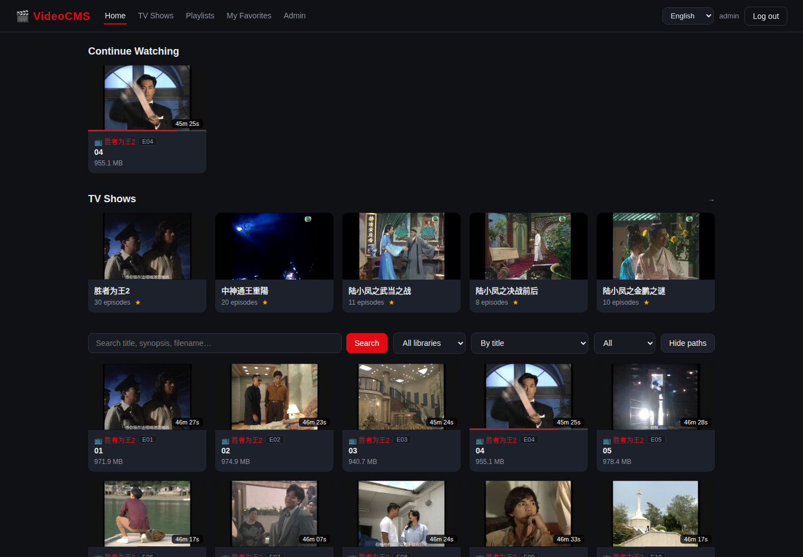
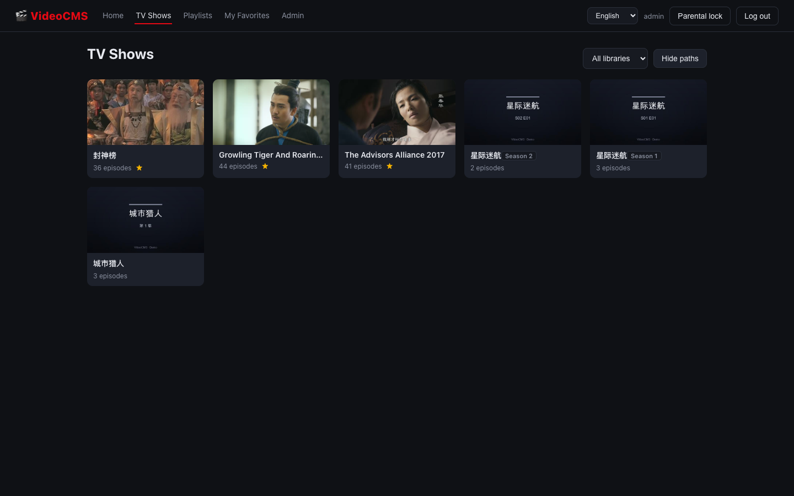
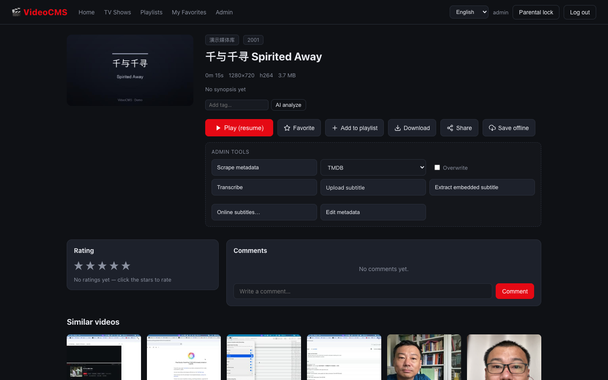
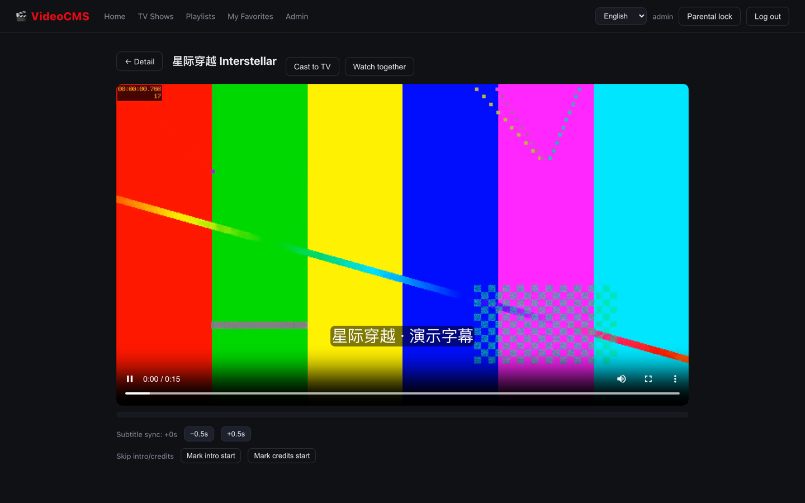

# 🎬 VideoCMS

> **セルフホスト型ビデオリソース管理システム** — Go · React · PostgreSQL

[](../LICENSE)


**言語:** [English](../README.md) | [中文](README.zh-CN.md) | 日本語

サーバーのディスク上のフォルダを、閲覧・検索可能なビデオライブラリに変えるシステムです。
一度スキャンすれば、すべての動画にポスター・メタデータ・視聴履歴・お気に入り・プレイリストが付き、
連番ファイルは自動でドラマとしてグループ化されます。

---

## 目次

- [機能](#機能)
- [スクリーンショット](#スクリーンショット)
- [ドキュメント](#ドキュメント)
- [クイックスタート](#クイックスタート)
- [LAN / スマホアクセス](#lan--スマホアクセス)
- [設定](#設定)
- [プロジェクト構成](#プロジェクト構成)
- [技術スタック](#技術スタック)
- [セキュリティ](#セキュリティ)
- [ロードマップ](#ロードマップ)
- [コントリビュート](#コントリビュート)
- [ライセンス](#ライセンス)

## 機能

| 分野 | ハイライト |
| --- | --- |
| 📂 メディアライブラリ | サーバー上の任意フォルダ。パス入力または内蔵**フォルダ選択 UI** |
| 🔍 スキャン | mp4/mkv/webm/avi/mov/ts… を再帰検出。並列プローブ（4 worker、`SCAN_WORKERS`）、リアルタイム進捗、**いつでもキャンセル**。macOS の `._` ファイルと `.m3u8` フォルダは自動スキップ |
| 🏷️ メタデータ | ffprobe でコーデック/解像度/再生時間、動画からポスター自動生成、タイトル/年/あらすじ/ジャンル編集可、任意の **TMDB スクレイピング** |
| 📺 ドラマ | 連番ファイル（`S01E01`、`EP1`、`第1集`、`タイトル01話名`…）を自動グループ化、シーズン対応、リスト連続再生 |
| ▶️ 再生 | H.264/WebM はネイティブ再生（HTTP Range）、**MKV/HEVC は多段階アダプティブ HLS にリアルタイム変換**（画質切替可）、字幕自動検出（SRT→WebVTT）、内蔵字幕の抽出・アップロード・**多言語切替**・ユーザー別字幕プリファレンス、ダウンロード対応 |
| 🔗 共有 | **動画・ドラマ・プレイリスト**の有効期限付き公開共有リンク（署名・期限・取り消し可・任意パスワード・ドメイン許可リスト）— リンクがあればログイン不要で視聴可能。コンテンツブロックにも従います |
| 👤 パーソナル | 続きを見る、お気に入り（動画・ドラマ）、連続再生できるプレイリスト |
| 🔐 ユーザー | JWT で登録/ログイン、管理者/一般ユーザー、ガード付きユーザー管理 |
| 🚫 コンテンツブロック | 管理者がタイトル単位でブロック — 全ユーザーに非表示、ファイルとレコードは保持、いつでも解除可能 |
| 🚫 ライブラリブロック | 管理画面からライブラリ全体をブロック — メディアは全ユーザーに非表示、何も削除されません |
| 🚫 パスフィルター | サーバーパスをユーザーごとに非表示化 — ホーム・ドラマ・お気に入り・続きを見る・プレイリストすべてに反映 |
| 🌐 インターフェース | i18n：**English（デフォルト）、中文、Français、日本語、Deutsch** |

## コンテンツ管理

誰に何が見えるかを決める独立した 3 層の仕組みです。いずれもファイルや
レコードを削除しません：

| 層 | 管理 | 対象 | 適用範囲 |
| --- | --- | --- | --- |
| 🏷️ タイトルブロック | 管理者 | タイトルに指定テキストを含む動画 | 全一覧・全ユーザー |
| 📚 ライブラリブロック | 管理者 | ライブラリ全体（すべての動画） | 全一覧・全ユーザー |
| 🛤️ パスフィルター | 各ユーザー | ユーザーが選んだサーバーパス | 全一覧・そのユーザーのみ |

3 層ともすべての一覧（ホーム・ドラマ・お気に入り・続きを見る・プレイリスト）で
SQL 評価され、ブロックされた項目は一斉に消え、解除すると即座に復元されます。

## スクリーンショット






## ドキュメント

すべてのドキュメントは多言語です。**[ドキュメント索引](INDEX.md)** から始めてください：

| ドキュメント | 言語 | 対象 |
| --- | --- | --- |
| [製品ドキュメント](product.ja.md) | EN · 中文 · FR · JA · DE | エンドユーザー |
| [システムアーキテクチャ](architecture.ja.md) | EN · 中文 · JA | 開発者 |
| [English](../README.md) / [中文](README.zh-CN.md) / [日本語](README.ja.md) | English · 中文 · 日本語 | すべて |

## クイックスタート

### 必要な環境

- Go 1.26+（ビルド用、またはビルド済みバイナリ）
- PostgreSQL 14+
- ffmpeg + ffprobe（メタデータ、ポスター、トランスコード）
- Node.js 20+（フロントエンド開発のみ。本番 UI はバックエンドが配信）

### インストール

```bash
# 1. データベース
createdb videocms                          # または: docker compose up -d db

# 2.（任意）デモ動画を生成
./scripts/make-demo-media.sh

# 3. バックエンド — 初回起動でテーブル作成 + admin/admin123
cd backend && go run ./cmd/server

# 4. フロントエンド（開発モード、ホットリロード）
cd frontend && npm install && npm run dev  # http://localhost:5173
```

本番相当のシングルポート配信：

```bash
make serve                                 # UI をビルドし :8080 で一括配信
```

初期管理者 **admin / admin123** でログインし、すぐにパスワードを変更してください
（管理 → ユーザー管理 → パスワード再設定）。その後、管理 → ライブラリ → スキャン で
最初のライブラリを追加します。

## LAN / スマホアクセス

1. サーバーの IP を確認：`ipconfig getifaddr en0`（例 `192.168.3.19`）
2. スマホを**同じネットワーク**に接続 → `http://192.168.3.19:8080` を開く
3. 初回は macOS のファイアウォール許可が必要な場合があります

> 平文 HTTP + 開発用 JWT は信頼できる LAN のみ推奨。公開アクセスは[セキュリティ](#セキュリティ)を参照。

## 設定

すべて環境変数で設定します：

| 変数 | デフォルト | 用途 |
| --- | --- | --- |
| `PORT` | `8080` | リッスンアドレス |
| `DATABASE_URL` | `postgres://localhost:5432/videocms` | PostgreSQL DSN |
| `JWT_SECRET` | 開発用定数 | トークン署名鍵 — **本番では強力な値に** |
| `DATA_DIR` | `data` | ポスター + HLS セグメント |
| `ADMIN_USERNAME` / `ADMIN_PASSWORD` | admin / admin123 | 初期管理者 |
| `FFPROBE_BIN` / `FFMPEG_BIN` | 自動検出 | ツールパス（Homebrew フォールバック） |
| `TMDB_API_KEY` / `TMDB_LANGUAGE` | 空 / zh-CN | メタデータスクレイピング。キー未設定時は無料の TVMaze・AniList・Wikipedia を使用 |
| `TVMAZE_ENABLED` | `1` | `0` で免キー TVMaze フォールバックを無効化 |
| `ANILIST_ENABLED` | `1` | `0` で免キー AniList フォールバックを無効化 |
| `WIKIPEDIA_LANG` / `WIKIPEDIA_ENABLED` | `en` / `1` | 免キー Wikipedia フォールバックの言語版とスイッチ |
| `SCAN_WORKERS` | `4` | 並列スキャンワーカー数（1-16） |
| `WATCH_INTERVAL` | `30` | 増分スキャンの保険間隔（fsnotify イベントは即時反映）。`0` で監視無効 |
| `WEB_ROOT` | 自動（`frontend/dist`） | 本番モードのフロントエンドディレクトリ |

## プロジェクト構成

```
backend/                 Go サーバー（net/http + pgx）
  cmd/server/            エントリポイント
  internal/api/          HTTP ハンドラ、ルーティング、ミドルウェア
  internal/auth/         JWT + ロールミドルウェア
  internal/media/        スキャナー、TMDB スクレイパー、HLS 管理、ストリーミング
  internal/db/           プール + 埋め込み SQL マイグレーション
  internal/models/       ドメイン型
frontend/                React 19 SPA（Vite）
  src/i18n/locales/      en / zh / fr / ja / de
  src/pages/             ブラウズ、プレイヤー、ドラマ、プレイリスト、管理…
docs/                    全ドキュメント（多言語）
scripts/                 デモ素材ジェネレーター
```

## 技術スタック

| 層 | 技術 |
| --- | --- |
| バックエンド | Go（net/http、pgx/v5）、JWT（HS256）、bcrypt |
| フロントエンド | React 19、Vite 8、react-router、i18next、hls.js |
| データベース | PostgreSQL 14（埋め込み SQL マイグレーション） |
| メディア | ffprobe（メタデータ）、ffmpeg（ポスター、HLS トランスコード） |
| ドキュメント | Markdown + Mermaid（GitHub レンダリング） |
| 品質 | ESLint 10、Vitest 4、golangci-lint（CI で Lint・ユニットテスト） |

## セキュリティ

- 変更系操作はすべて管理者限定。メディア URL はユーザー JWT 必須（ヘッダーまたは `?token=`）
- パスワードは bcrypt、ロールは毎リクエスト DB から再取得
- HLS セグメント名は検証されセッションディレクトリ内に制限
- SQL はすべてパラメータ化
- **本番**：強力な `JWT_SECRET`、HTTPS リバースプロキシ、
  `ADMIN_USERNAME/ADMIN_PASSWORD` で初期アカウントを指定

[security.md](security.md) も参照してください。

## ロードマップ

計画中の機能は、同種のセルフホスト動画プロジェクト（Jellyfin、MediaCMS、
Stash、Kirari04/videocms、yt-dlp ツールなど）の機能セットを参考にしています。

### 完了

- [x] ライブラリスキャン（並列、キャンセル可能、リアルタイム進捗）+ イベント駆動のファイル監視
- [x] メタデータ + ポスター：TMDB スクレイピング、キーなしで TVMaze にフォールバック
- [x] ネイティブ再生 + アダプティブビットレート HLS トランスコード
- [x] ドラマ自動グループ化（S01E01、EP1、第N集、数字のみのファイル名…）
- [x] お気に入り（動画・ドラマ）、プレイリスト、続きを見る
- [x] コンテンツ管理：タイトルブロック、ライブラリブロック、ユーザー別パスフィルター
- [x] 字幕：埋め込み抽出、アップロード、多言語トラック、ユーザーごとの設定
- [x] 公開共有：動画・ドラマ・プレイリストの署名付き短時間 URL（パスワード・ドメイン許可リスト対応）
- [x] i18n（en/zh/fr/ja/de）
- [x] 管理：データエクスポート/バックアップ、サーバーフォルダを開く、フォルダ選択 UI

### 計画中

**アップロードとダウンロード**

- [x] ブラウザからのチャンク/再開対応アップロード（キュー式アップロードマネージャー）
- [x] MP4/MKV としてダウンロード、音声/字幕トラックを選択（再エンコードなし）
- [x] yt-dlp 統合：オンラインサイトの動画/チャンネルをスケジュールで取り込み

**再生と字幕**

- [ ] 複数音声トラックとプレイヤー内切り替え（トラックは動画外に保存）
- [ ] スタイル付き（ASS）ソフト字幕と字幕同期/オフセット調整
- [ ] 字幕の自動ダウンロードとマッチング
- [ ] ハードウェアアクセラレーション（VAAPI/NVENC/QSV）+ HDR トーンマッピング
- [ ] プレビューサムネイル/シークバー、イントロ・クレジットスキップ
- [ ] 一緒に見る（同期再生セッション）とキャスト（Chromecast/DLNA/AirPlay）
- [ ] RTMP ライブ取り込みと内蔵チャット

**メタデータと AI**

- [ ] ローカル音声文字起こし（Whisper）→ 検索可能な文字起こし/字幕
- [ ] プラグイン式メタデータソース / カスタムスクレイパー（個別上書き対応）
- [ ] AI タグ付け、シーン検出、画像解析による検索向上
- [ ] メディアヘルスチェック：重複検出、破損チェック、ベスト版を残す整理
- [ ] 類似動画レコメンドとタグクラウド

**整理と検索**

- [ ] ユーザー定義タグ、スマートコレクション、保存済みフィルター
- [ ] タイトル/概要/文字起こし/タグの全文・あいまい検索
- [ ] 一括整理（移動・リネーム・一括タグ付け）+ ゴミ箱
- [ ] NFO メタデータのインポート/エクスポート（Plex/Jellyfin/Kodi 互換）

**ユーザー・共有・ソーシャル**

- [ ] コメント、評価、アクティビティフィード
- [ ] OIDC/SAML シングルサインオン
- [ ] ペアレンタルコントロール（PIN/レーティング）とユーザーごとのクォータ
- [ ] 共有ページのカスタマイズとプレイヤー埋め込み
- [ ] 通知（メール/Webhook/Apprise）：スキャン・アップロード・トランスコードイベント

**ストレージと運用**

- [ ] ストレージプール：ローカル・S3 互換・SFTP、管理 UI からルーティング
- [ ] バックグラウンドジョブダッシュボード（監視/キャンセル/リトライ）+ 詳細なシステム統計
- [ ] 定期メンテナンス：再スキャン、ヘルスチェック、メタデータのバックアップ/復元
- [ ] Webhook + 成熟した公開 REST API によるサードパーティ自動化
- [ ] PWA オフラインダウンロードとモバイル UX の改善

## コントリビュート

コントリビューションを歓迎します！ コントリビュートガイドを参照してください：

- 日本語：[contributing.ja.md](contributing.ja.md)
- English：[contributing.md](contributing.md)
- 中文：[contributing.zh-CN.md](contributing.zh-CN.md)

## ライセンス

[Apache License 2.0](../LICENSE)
