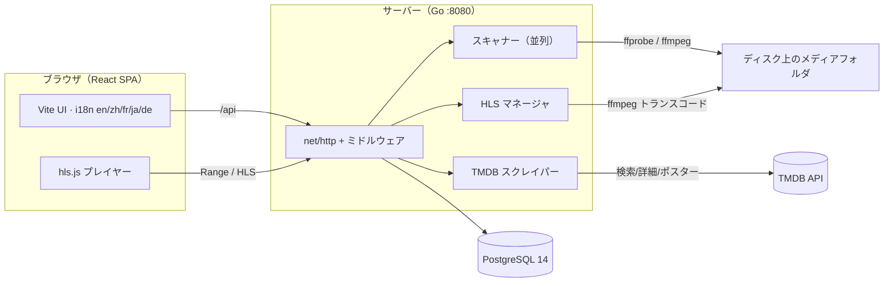
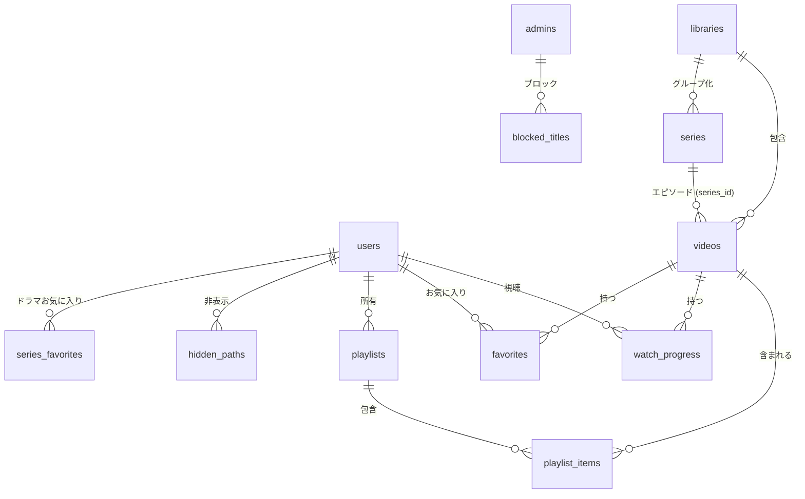
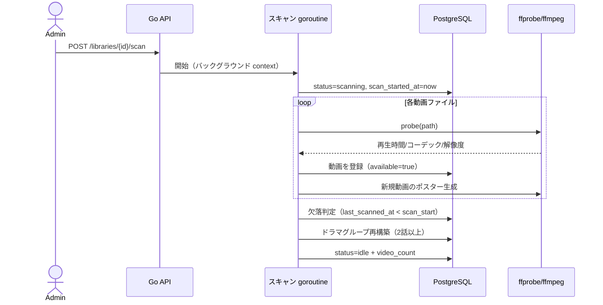
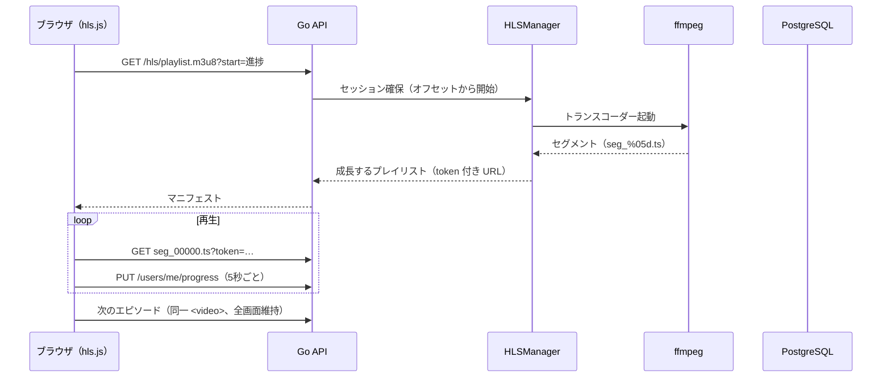

# VideoCMS — システムアーキテクチャ設計

> **言語:** [English](architecture.md) | [中文](architecture.zh-CN.md) | 日本語

## 1. 概要

VideoCMS はセルフホスト型のビデオリソース管理システムです。サーバー上のフォルダを指定すると、
スキャンしてメディアライブラリに取り込み、メタデータを抽出し、Web プレイヤーで閲覧・再生できます。
Emby / Jellyfin に代わる、軽量で拡張性が高く、所有者が完全に管理できるシステムを目指しています。

### 1.1 目標

- サーバー上の任意のフォルダを検索可能なビデオライブラリとして取り込む
- 技術メタデータ（コーデック・解像度・再生時間）を抽出し、ポスター・あらすじ・ジャンルを補完
  （ファイル名解析、ffmpeg フレーム抽出、任意の TMDB スクレイピング）
- ブラウザで再生 — 対応形式はネイティブ再生、非対応形式はリアルタイム HLS トランスコード
- ユーザーごとの状態：視聴履歴、お気に入り、プレイリスト
- 管理機能：ライブラリ管理、メタデータ編集、ユーザー管理
- 多言語 UI（en/zh/fr/ja/de）、デフォルトは英語

### 1.2 現在の対象外

- オンラインストリーミング連携・P2P はなし

## 2. システム全体像



```
┌────────────────────┐      HTTP/JSON + Range ストリーミング      ┌─────────────────────────┐
│  React SPA (Vite)   │ ────────────────────────────────────────▶ │  Go バックエンド (:8080) │
│  i18n en/zh/fr/ja/de│                                           │  net/http + pgx         │
└─────────┬──────────┘                                           └────────────┬────────────┘
          │  /api プロキシ（開発）/ 静的配信（本番）                           │ ffprobe / ffmpeg
          │                                                                    ▼
          └────────────────────────────────────────────────── メディアライブラリ（ディスク）
                                                              │
                     PostgreSQL 14 ── メタデータ / ユーザー / 履歴 / お気に入り / プレイリスト
```

3 つの実行部分：

| 部分 | 技術 | 責務 |
| --- | --- | --- |
| Web UI | React 18、Vite、react-router、i18next、hls.js | 閲覧・検索・再生、管理画面、言語切替 |
| バックエンド | Go（net/http 標準ライブラリ、pgx/v5） | 認証、ライブラリ管理、スキャン、ストリーミング、HLS、スクレイピング |
| ストレージ | PostgreSQL 14 + サーバーディスク | メタデータ DB。動画ファイル・生成ポスター・HLS セグメントはディスク |

## 3. バックエンド設計

### 3.1 レイヤー構成

```
backend/
  cmd/server/main.go          エントリ：設定 → DB → マイグレーション → HTTP サーバー
  internal/
    config/                   環境変数ベースの設定
    db/                       pgx プール、埋め込み SQL マイグレーション、初期 admin 作成
    models/                   共有ドメイン型
    auth/                     JWT 署名/検証、認証ミドルウェア（Bearer または ?token=）
    media/
      scanner.go              ライブラリスキャン（並列探索 + プローブ + 書き込み）
      scraper.go              TMDB メタデータ補完
      hls.go                  HLS トランスコードセッション管理
      stream.go               HTTP Range ストリーミング
      segment.go              HLS セグメントファイル名検証
    api/
      router.go               ルーティング、CORS / ログ / リカバリミドルウェア
      json.go                 JSON ヘルパー
      handlers_*.go           ドメインごとの HTTP ハンドラ
```

### 3.2 HTTP レイヤー

- ルーティングは Go 1.22+ の `net/http.ServeMux` パターン
  （`"GET /api/videos/{id}"`、`"GET /api/videos/{id}/hls/{file...}"`）
- ミドルウェアチェーン：panic リカバリ → リクエストログ → CORS
- リクエストボディはサイズ制限（`http.MaxBytesReader`）
- API レスポンスはすべて JSON。エラーは `{"error": "..."}`、一覧は
  `{"items": [...], "total", "page", "page_size"}`

### 3.3 認証と認可

- パスワードは **bcrypt** でハッシュ化。ログインで **HS256 JWT** を発行（7 日間有効）
- 標準は `Authorization: Bearer <token>`。メディアエンドポイント
  （`<video>`/`` はヘッダーを設定できない）は `?token=<jwt>` も受け付ける
- 2 つのロール：`user` と `admin`
  - `RequireAuth` は毎リクエスト DB からユーザーを再取得するため、ロール変更が即時反映
  - `RequireAdmin` はライブラリ変更・メタデータ編集・スクレイピング・統計・
    ディレクトリ閲覧・ユーザー管理を保護
- ユーザー管理ガード：自分自身は削除不可、最後の 1 人の管理者は削除・降格不可

### 3.4 データベーススキーマ

埋め込み SQL マイグレーションで管理（`schema_migrations` テーブルがバージョン管理）。

```sql
users           -- id, username(ユニーク), password_hash, display_name, role, created_at
libraries       -- id, name, path(ユニーク), scan_status(idle|scanning|error|cancelled),
                --   scan_error, scan_started_at, scan_finished_at, video_count,
                --   blocked
videos          -- id, library_id(FK), title, filename, file_path(ユニーク), size_bytes,
                --   duration_sec, width, height, video_codec, container, year, synopsis,
                --   genres(text[]), poster_path, subtitle_path, tmdb_id, scraped_at,
                --   available, created_at, updated_at, last_scanned_at
watch_progress  -- PK(user_id, video_id), position_sec, duration_sec, updated_at
favorites       -- PK(user_id, video_id), created_at
playlists       -- id, user_id(FK), name, description, タイムスタンプ
playlist_items  -- PK(playlist_id, video_id), position, added_at
series          -- id, library_id(FK), name, season, episode_count, タイムスタンプ
videos          -- + series_id(FK→series, ON DELETE SET NULL), season, episode
blocked_titles  -- id, title, created_at（管理者によるタイトル単位のブロック）
hidden_paths    -- id, user_id(FK), path, created_at（ユーザーごとのパス非表示）
series_favorites-- PK(user_id, series_id), created_at
share_tokens    -- id, scope(video|series|playlist), video_id/series_id/playlist_id
                --   (FK, ON DELETE CASCADE), token(ユニーク), expires_at,
                --   password_hash（任意 bcrypt）, allowed_domains（text[]）,
                --   created_by(FK→users), created_at（公開共有リンク）
subtitle_tracks -- id, video_id(FK, ON DELETE CASCADE), position, lang, title,
                --   path, kind(sidecar|embedded|upload), source_key(動画内でユニーク),
                --   stream_index（多言語字幕トラック）
user_subtitle_prefs -- PK(user_id, video_id), track_id(FK, ON DELETE CASCADE),
                --   updated_at（ユーザー別の既定字幕トラック）
```

主要インデックス：`videos(lower(title))`、`videos(library_id)`、部分インデックス
`videos(available) WHERE available`、`watch_progress(user_id, updated_at DESC)`、
`playlist_items(playlist_id, position)`。



### 3.5 ストリーミング（HTTP Range）

`GET /api/videos/{id}/stream` はディスク上のファイルを開き、`Accept-Ranges: bytes` で
単一 Range リクエスト（`206 Partial Content`）に対応。Content-Type は拡張子から決定
（`video/mp4`、`video/x-matroska` など）。ブラウザ互換ファイルは CPU 負荷ゼロです。

### 3.6 HLS トランスコード

ブラウザで再生できない形式（MKV / HEVC など）は、
`GET /api/videos/{id}/hls/playlist.m3u8?start=<秒>` にフォールバックします。

`HLSManager`：

- ビデオごとに 1 つの ffmpeg プロセスを起動し、アダプティブな多段階レンディション
  （1280/854/640/426px、ソース解像度で上限）を同時生成：
  `-ss <start> -i <input> -c:v libx264 -preset veryfast -crf 23
  -vf scale=<width>:-2 -force_key_frames expr:gte(t,n_forced*6) -c:a aac -b:a 96k
  -f hls -hls_time 6 -hls_list_size 0 -hls_flags independent_segments`
- 各レンディションは `data/hls/<video-id>/v<幅>/` に書き込み。サーバーは全
  レンディションと、字幕トラックごとに `#EXT-X-MEDIA` エントリ
  （`subs/<トラックid>/playlist.m3u8`、内蔵トラックは初回リクエスト時に遅延抽出）を
  参照する master プレイリストを生成。プレイリストは変換中に成長し、ffmpeg 完了後に
  サーバーが `#EXT-X-ENDLIST` を追記
- 要求された `start` が実行中セッションと 1 セグメント（6 秒）以上ずれている場合、
  セッションを終了して新しい位置で再開（シーク）
- プレイリストは応答時に書き換えられ、各セグメント URL に `?token=` が付く
- アイドルセッションは **15 分**で回収され、ディレクトリごと削除
- サーバーはトランスコードをブロックしない：最初の完成セグメントから再生開始

### 3.7 メディアスキャナー

ライブラリごとにバックグラウンド goroutine で `Scanner.scan` を実行：

1. `scan_status=scanning` を設定し `scan_started_at` を記録
2. `filepath.WalkDir` で動画ファイルを探索。隠しファイル/ディレクトリ、`.m3u8` HLS
   フォルダ（および macOS の `._` リソースフォーク）はスキップ
3. ワーカープール（デフォルト **4**、`SCAN_WORKERS` で 1-16）が ffprobe で各ファイルを
   プローブ（30 秒タイムアウト）し、動画レコードを書き込み
4. 新規レコードは ffmpeg でポスターフレームを抽出（60 秒タイムアウト、
   `scale=480:-2`、15% 地点のフレーム）。同ディレクトリの字幕（`.srt/.vtt/.ass/.ssa`）と
   すべての内蔵テキスト字幕トラックを `subtitle_tracks` に登録し、先頭を
   有効な `subtitle_path` に
5. 20 件ごとに `video_count` を更新し、UI にリアルタイム進捗を表示
6. 完了後、今回スキャンされなかったファイルは `available=false` に
   （`last_scanned_at < scan_start` 基準）。キャンセル時に誤判定しない
7. キャンセル（`POST /api/libraries/{id}/scan/cancel`）は context をキャンセルし、
   ステータスを `cancelled` に。取り込み済みレコードは保持
8. panic はリカバリされ `scan_status=error` に。サーバー再起動時は残った `scanning`
   状態を `error` にリセット

**増分取り込み**：`Scanner.Watch` は fsnotify イベント監視（再帰、ライブラリの
ルートごとに 1 つ）と差分スキャンを組み合わせます。変更ファイル（サイズが同じ
変更を含む）は数秒以内に再プローブされ、削除されたファイル/ディレクトリは
即座に利用不可に。さらに `WATCH_INTERVAL` ごとの全量差分スキャンも保険として継続

**ドラマ自動グループ化**：スキャン後に `rebuildSeries` がタイトルからエピソード
マーカー（`S01E01`、`EP1`、`E01`、`第1集`、末尾のかっこ数字など）を解析し、
共通プレフィックス + シーズンを共有する動画をグループ化。2 話以上あれば `series` 行を
作成します。動画には `series_id/season/episode` を保存し、
`GET /api/series` で一覧され、独立した「ドラマ」カテゴリとして閲覧できます。
2 話未満になったシリーズは自動的に整理されます。

プローブ失敗のファイルも空の技術メタデータで登録されるため、所有者は内容を確認して判断できます。

### 3.8 メタデータスクレイピング（TMDB / TVMaze / AniList / Wikipedia）

任意。`TMDB_API_KEY` 設定時は TMDB、未設定時は免キーの TVMaze、AniList、
Wikipedia の順に自動フォールバック（`TVMAZE_ENABLED=0` / `ANILIST_ENABLED=0` /
`WIKIPEDIA_ENABLED=0` で個別に無効化）。`Scraper`：

- プロバイダを検索（TMDB の言語は設定可能、デフォルト `zh-CN`）。TMDB ではさらに
  詳細を取得してローカライズ済みジャンル名を取得
- `w500` ポスターを `data/posters/<video-id>.<ext>` にダウンロード
- `title, year, synopsis, genres, poster_path, tmdb_id, scraped_at` を更新
- レート制限：400ms に 1 リクエスト
- スキャン時は「あらすじがなく未取得の動画」だけを補完。手動
  `POST /api/videos/{id}/scrape` は常に上書き

### 3.9 管理エンドポイント

- `GET /api/admin/stats` — 集計統計と総バイト数
- `GET /api/admin/paths?path=…` — サーバーディレクトリブラウザ（サブディレクトリ、
  親、ホームショートカット、`statfs` による空き容量）。フォルダ選択 UI で使用
- ユーザー管理：一覧 / ロール変更 / パスワード再設定 / 削除（ガード付き）
- コンテンツブロック：`GET|POST /api/admin/blocked-titles`、
  `DELETE /api/admin/blocked-titles/{id}` — タイトルを大文字小文字を無視した
  部分一致で判定。ブロックされたメディアはディスクに残り、解除で即座に復元
- ライブラリブロック：`PATCH /api/libraries/{id}`（`{"blocked": true|false}`）
  でライブラリ全体を非表示。フラグは同じ SQL 可視性条件で評価
- ライブラリフォルダを開く：`POST /api/libraries/{id}/open` はサーバー上で
  システムのファイルマネージャー（`open` / `xdg-open` / `explorer`）を起動します

### 3.10 主要な設計判断

- **標準ライブラリのみ** — Go の `net/http` ルーティングと `pgx` を直接使用。
  フレームワーク非依存で監査が容易
- **バックグラウンドスキャン + ワーカープール** — プローブは外部ディスクで I/O 負荷が高い。
  4 ワーカー（設定可能）でスループットと CPU を調整。進捗は DB に書き込み、
  UI は長接続ではなくシンプルなステータスをポーリング
- **同一要素での再生切替** — プレイヤーは `<video>` 要素を破棄せずソースを差し替えるため、
  エピソード連続再生でもブラウザの全画面が維持される
- **HLS はライブ成長型プレイリスト** — ffmpeg がその場でマニフェストを書き、
  完了時に `#EXT-X-ENDLIST` を追記。セグメントは完成後にのみ参照されるため、
  数時間のファイルでも約 1 秒で再生開始
- **ユーザー単位のプライバシーフィルター** — 非表示パスは SQL（`starts_with`）で評価し、
  すべての一覧に一貫して適用
- **管理者によるコンテンツブロック** — `blocked_titles` は同じ可視性条件
  （`visibleEpisodes`）に組み込まれ、ブロックされたメディアはすべての一覧
  （ドラマ・お気に入り・プレイリスト含む）から即座に消えます。ファイルには影響せず、
  管理者は `GET /api/videos?include_blocked=1` でブロック済みを確認できます
- **ライブラリ単位のブロック** — `libraries.blocked` は `visiblePaths` 内で
  `NOT EXISTS (SELECT 1 FROM libraries lb WHERE lb.id = v.library_id AND lb.blocked)`
  として評価され、ブロックされたライブラリはユーザー向けの全一覧（ドラマや
  続きを見る含む）から一度に消えます
- **メディア URL はユーザー JWT を保持**（`?token=`）— `<video>`/`` はヘッダーを設定できないため

## 4. フロントエンド設計

### 4.1 構成

```
frontend/src/
  api.js           fetch ラッパー（token、JSON、401 リダイレクト）
  auth.jsx         認証コンテキスト（ユーザー、ログイン/登録/ログアウト）
  i18n/            i18next 設定 + en/zh/fr/ja/de ロケール JSON
  components/      Navbar、Poster、VideoCard、PathPicker、Toast
  pages/           Login、Browse、VideoDetail、Player、Playlists、
                   PlaylistDetail、Favorites、Admin
```

### 4.2 ルーティングと状態

- `react-router-dom` v6。未認証ユーザーは `/login` へリダイレクト
- 認証状態は React コンテキスト、JWT は `localStorage` に保存
- i18n：`i18next` + `react-i18next`、デフォルト **英語**、選択は `localStorage` に保存、
  en/zh/fr/ja/de 対応

### 4.3 再生

- H.264 MP4 / WebM / MOV → ネイティブ `<video>` + Range ストリーミング
- その他の形式 → 動的 `import('hls.js')` で `start` オフセット付き HLS 再生。
  バッファ外シークではトランスコードセッションを再起動
- 再生 5 秒ごと、および一時停止/終了時に進捗を保存（絶対位置 = セッションオフセット + メディア時間）
- ネイティブ再生に失敗した場合は「トランスコード再生」を提案

### 4.4 管理 UI

タブ：概要（統計）、ライブラリ（サーバーフォルダ選択 UI で追加、スキャン/停止、削除）、
動画（検索、メタデータ編集、スクレイピング、ポスターアップロード）、
ユーザー（ロール、パスワード再設定、削除）。

## 5. 主要フロー

### 5.1 ライブラリスキャン



```
管理 UI ──POST /api/libraries/{id}/scan──▶ scanner.Start（goroutine）
   │                                          │
   │  ポーリング GET /api/libraries（3 秒）    ├─ WalkDir（隠し/.m3u8 スキップ）
   │                                          ├─ ワーカープール：ffprobe → 登録 → ポスター
   │                                          ├─ 20 件ごとに video_count 更新
   │                                          └─ 欠落判定 → idle/error/cancelled
   ◀── スキャン状態 + リアルタイム件数 ───────┘
```

### 5.2 再生（非対応形式）



```
プレイヤー ──GET /hls/playlist.m3u8?start=進捗──▶ HLSManager
   │                                               ├─ ffmpeg セッション開始/終了
   │  セグメント（?token= 付き）◀─────────────────┴─ data/hls/<id>/ に書き込み
   └─ hls.js → <video> ──5 秒ごとに PUT /users/me/progress
```

## 6. 設定

### 6.1 デプロイ形態

| モード | 方法 | 備考 |
| --- | --- | --- |
| 開発 | `go run ./cmd/server` + `npm run dev` | Vite が `/api` を :8080 へプロキシ。ホットリロード |
| シングルポート本番 | `make serve` | バックエンドが `frontend/dist` を配信。UI と API が同一ポート |
| Docker データベース | `docker compose up -d db` | PostgreSQL 14 コンテナ。バックエンドはネイティブ実行 |
| リバースプロキシ | Nginx/Caddy → :8080 + TLS | 公開アクセス推奨。`JWT_SECRET` を設定 |

バックエンドは全インターフェース（`:8080`）にバインドするため、LAN クライアントから直接 UI にアクセスできます。

| 変数 | デフォルト | 用途 |
| --- | --- | --- |
| `PORT` | `8080` | リッスンアドレス |
| `DATABASE_URL` | `postgres://localhost:5432/videocms` | PostgreSQL DSN |
| `JWT_SECRET` | 開発用定数 | トークン署名鍵（本番では必ず設定） |
| `DATA_DIR` | `data` | ポスター + HLS セグメント |
| `ADMIN_USERNAME` / `ADMIN_PASSWORD` | admin / admin123 | 初期管理者 |
| `FFPROBE_BIN` / `FFMPEG_BIN` | 自動検出 | ツールパス（Homebrew フォールバック） |
| `TMDB_API_KEY` / `TMDB_LANGUAGE` | 空 / zh-CN | スクレイピング |
| `SCAN_WORKERS` | `4` | 並列プローブ数 |
| `WEB_ROOT` | 自動（`frontend/dist`） | 本番モードのフロントエンドディレクトリ |

## 7. セキュリティ考慮

- 変更・閲覧系エンドポイントはすべて管理者限定
- メディア URL にはユーザー JWT が必要（ヘッダーまたはクエリパラメータ）
- HLS セグメント名は厳密に検証（`seg_\d+\.ts`）し、セッションディレクトリ内に制限
- SQL は pgx で全箇所パラメータ化
- デフォルト `JWT_SECRET` は開発専用。平文 HTTP は信頼できる LAN のみ推奨。
  公開アクセスには HTTPS リバースプロキシを前段に配置

## 8. パフォーマンスメモ

- 直接再生ファイルのストリーミングはディスク I/O がボトルネック（トランスコードなし）
- 並列スキャン（4 ワーカー）は外付け USB ドライブで約 1,600 ファイルを約 80 秒で処理
- `._` リソースフォークと `.m3u8` セグメントフォルダをスキップし、無駄なプローブを数千回削減
- DB はインデックス化、一覧はページング（デフォルト 1 ページ 24 件）
- HLS トランスコードはセッションごとに最大 4 レンディションで CPU 負荷が高く、
  アイドルセッションは回収

## 9. 拡張ポイント

- **JAV DB メタデータプロバイダ**（API キーが必要。免キーの TMDB/TVMaze/
  AniList/Wikipedia で一般的なニーズはカバー済み）
