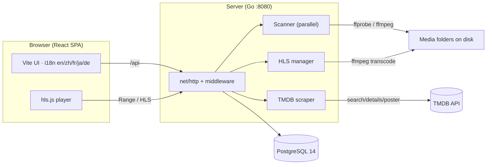
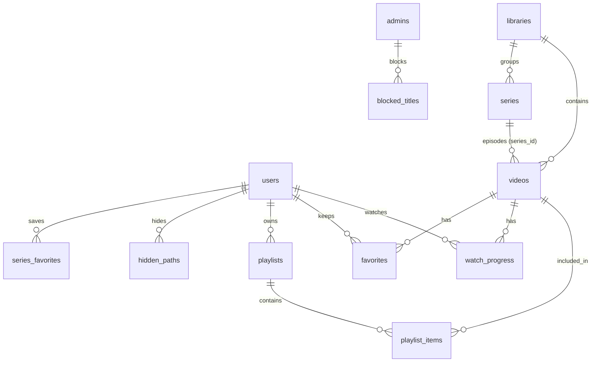
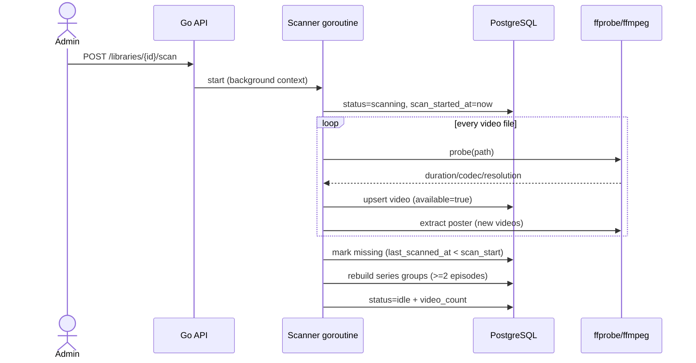
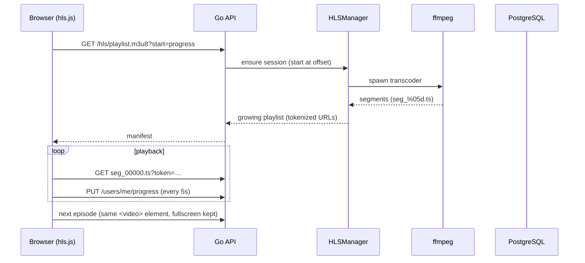

# VideoCMS — System Architecture Design

> **Languages:** English | [中文](architecture.zh-CN.md) | [日本語](architecture.ja.md)

## 1. Overview

VideoCMS is a self-hosted video resource management system. Users point the server at
folders on disk; the system scans them into a media library, extracts metadata, and
serves the videos through a web player. The goal is a lightweight, extensible
alternative to Emby/Jellyfin that is fully under the owner's control.

### 1.1 Goals

- Scan arbitrary server folders into a searchable video library
- Extract technical metadata (codec, resolution, duration) and enrich with posters,
  synopsis and genres (filename parsing, ffmpeg frames, optional TMDB scraping)
- Play videos in the browser — natively when possible, via on-the-fly HLS
  transcoding otherwise
- Per-user state: watch progress, favorites, playlists
- Admin capabilities: library management, metadata editing, user management
- Multi-language UI (en/zh/fr/ja/de) with English as default

### 1.2 Non-goals (current scope)

- No online streaming service integration, no P2P

## 2. System Overview



```
┌────────────────────┐        HTTP/JSON + Range streaming        ┌─────────────────────────┐
│  React SPA (Vite)   │ ────────────────────────────────────────▶ │  Go backend (:8080)     │
│  i18n en/zh/fr/ja/de│                                           │  net/http + pgx         │
└─────────┬──────────┘                                           └────────────┬────────────┘
          │  /api proxy (dev) / static hosting (prod)                          │ ffprobe / ffmpeg
          │                                                                    ▼
          └──────────────────────────────────────────────────  Media library folders (disk)
                                                              │
                     PostgreSQL 14 ── metadata / users / progress / favorites / playlists
```

Three runtime parts:

| Part | Technology | Responsibility |
| --- | --- | --- |
| Web UI | React 19, Vite 8, react-router, i18next, hls.js | Browse/search/play, admin console, language switching |
| Backend | Go (net/http stdlib, pgx/v5) | Auth, media library management, scanning, streaming, HLS, scraping |
| Storage | PostgreSQL 14 + server disk | Metadata database; video files and generated posters/HLS live on disk |

## 3. Backend Design

### 3.1 Layer structure

```
backend/
  cmd/server/main.go          entry: config → DB → migrations → HTTP server
  internal/
    config/                   environment-based configuration
    db/                       pgx pool, embedded SQL migrations, admin seeding
    models/                   shared domain types
    auth/                     JWT sign/verify, auth middleware (Bearer or ?token=)
    media/
      scanner.go              library scanning (parallel walk + probe + upsert)
      scraper.go              TMDB metadata enrichment
      hls.go                  HLS transcode session manager
      stream.go               HTTP Range streaming
      segment.go              HLS segment filename validation
      tracks.go               ffprobe stream listing for remux downloads
      downloader.go           yt-dlp job runner (queue + schedule)
    api/
      router.go               route table, CORS/logging/recovery middleware
      json.go                 JSON helpers
      handlers_*.go           HTTP handlers grouped by domain
```

### 3.2 HTTP layer

- Routing uses Go 1.26+ `net/http.ServeMux` patterns
  (`"GET /api/videos/{id}"`, `"GET /api/videos/{id}/hls/{file...}"`)
- A middleware chain wraps the mux: panic recovery → request logging → CORS
  (wildcard by default; restrict with `CORS_ORIGINS` for separate frontend
  deployments)
- Request bodies are size-limited (`http.MaxBytesReader`)
- All API responses are JSON; errors follow `{"error": "..."}`; success payloads
  are domain objects or `{"items": [...], "total", "page", "page_size"}` for lists

### 3.3 Authentication & authorization

- Passwords hashed with **bcrypt**; login issues an **HS256 JWT** (7-day expiry)
- `Authorization: Bearer <token>` is the default; media endpoints (`<video>`/``
  cannot set headers) additionally accept `?token=<jwt>`
- Two roles: `user` and `admin`
  - `RequireAuth` loads the user fresh from the DB on every request, so role
    changes take effect immediately
  - `RequireAdmin` gates library mutation, metadata edits, scraping, stats,
    directory browsing and user management
- Admin user management guards: cannot delete yourself, cannot delete/demote the
  last remaining admin

### 3.4 Database schema

Managed by embedded SQL migrations (`schema_migrations` table tracks versions).

```sql
users           -- id, username(unique), password_hash, display_name, role, created_at
libraries       -- id, name, path(unique), scan_status(idle|scanning|error|cancelled),
                --   scan_error, scan_started_at, scan_finished_at, video_count,
                --   blocked
videos          -- id, library_id(fk), title, filename, file_path(unique), size_bytes,
                --   duration_sec, width, height, video_codec, container, year, synopsis,
                --   genres(text[]), poster_path, subtitle_path, tmdb_id, scraped_at,
                --   available, created_at, updated_at, last_scanned_at
watch_progress  -- PK(user_id, video_id), position_sec, duration_sec, updated_at
favorites       -- PK(user_id, video_id), created_at
playlists       -- id, user_id(fk), name, description, timestamps
playlist_items  -- PK(playlist_id, video_id), position, added_at
series          -- id, library_id(fk), name, season, episode_count, timestamps
videos          -- + series_id(fk → series, ON DELETE SET NULL), season, episode
blocked_titles  -- id, title, created_at (admin content blocking by title match)
hidden_paths    -- id, user_id(fk), path, created_at (per-user path filters)
series_favorites-- PK(user_id, series_id), created_at
share_tokens    -- id, scope(video|series|playlist), video_id/series_id/playlist_id
                --   (fk, ON DELETE CASCADE), token(unique), expires_at,
                --   password_hash (optional bcrypt), allowed_domains (text[]),
                --   created_by(fk → users), created_at (public share links)
subtitle_tracks -- id, video_id(fk, ON DELETE CASCADE), position, lang, title,
                --   path, kind(sidecar|embedded|upload), source_key(unique per video),
                --   stream_index (multi-language subtitle tracks)
user_subtitle_prefs -- PK(user_id, video_id), track_id(fk, ON DELETE CASCADE),
                --   updated_at (per-user default subtitle track)
subtitle_offsets -- PK(user_id, video_id), offset_ms, updated_at
                --   (per-user subtitle sync; applied when serving WebVTT)
uploads         -- id, filename, target_path, total_size, chunk_size,
                --   status(uploading|completed|failed), error, timestamps
                --   (chunked upload sessions; chunks live in DATA_DIR/uploads/<id>/)
downloads       -- id, url, title, target_path, format, status(queued|downloading|
                --   completed|failed|canceled), progress, error, interval_secs,
                --   last_run_at, timestamps (yt-dlp jobs, optional schedule)
```

Key indexes: `videos(lower(title))`, `videos(library_id)`, partial
`videos(available) WHERE available`, `watch_progress(user_id, updated_at DESC)`,
`playlist_items(playlist_id, position)`.



### 3.5 Streaming (HTTP Range)

`GET /api/videos/{id}/stream` opens the file on disk and serves it with
`Accept-Ranges: bytes`, supporting single-range requests (`206 Partial Content`).
Content type is derived from the file extension (`video/mp4`, `video/x-matroska`, …).
This keeps CPU usage at zero for browser-compatible files.

### 3.6 HLS transcoding

For formats browsers cannot play (e.g. MKV/HEVC), the player falls back to
`GET /api/videos/{id}/hls/playlist.m3u8?start=<sec>`.

The `HLSManager`:

- Starts one ffmpeg process per video session that emits an adaptive ladder of
  renditions (1280/854/640/426px, capped by the source resolution):
  `-ss <start> -i <input> -c:v libx264 -preset veryfast -crf 23
  -vf scale=<width>:-2 -force_key_frames expr:gte(t,n_forced*6) -c:a aac -b:a 96k
  -f hls -hls_time 6 -hls_list_size 0 -hls_flags independent_segments`
- Video encoding is software x264 by default; `HLS_HW_ACCEL=videotoolbox|nvenc|qsv|vaapi`
  switches to a hardware encoder (`h264_videotoolbox` / `h264_nvenc` /
  `h264_qsv` / `h264_vaapi`), with VAAPI taking its device from
  `HLS_VAAPI_DEVICE` and running the `hwupload`/`scale_vaapi` pipeline.
  `HLS_TONE_MAP=1` prepends a software `zscale`+`tonemap` chain for HDR→SDR
  playback; invalid accel values fail the session instead of silently degrading
- Each rendition is written to `data/hls/<video-id>/v<width>/`; the server
  writes a master playlist referencing every rendition and one
  `#EXT-X-MEDIA` subtitle entry per track (`subs/<track-id>/playlist.m3u8`,
  lazy-extracting embedded tracks on first request). Playlists grow while
  transcoding and `#EXT-X-ENDLIST` is appended server-side when ffmpeg finishes
- Multi-audio sources: each audio stream is remuxed to its own AAC HLS track
  (`a<index>/`), advertised through an `#EXT-X-MEDIA` AUDIO group that video
  renditions reference (`AUDIO="audio"`), so players can switch audio without
  restarting the transcode session
- Subtitle sync: `GET /api/videos/{id}/subtitles/{trackId}?offset_ms=…` shifts
  every cue (WebVTT/SRT), backed by per-user `subtitle_offsets` so direct
  playback remembers the adjustment
- Trick-play preview: `GET /api/videos/{id}/thumbnails` lazily extracts one
  160×90 frame every 10s (max 120) into `DATA_DIR/thumbnails/<video-id>/`;
  `GET /api/videos/{id}/thumbnails/{n}` serves a frame, and the player shows
  the frame nearest the hovered time on a seek strip
- Styled ASS subtitles: `.ass/.ssa` tracks carry a `format` field, are excluded
  from the hls.js subtitle group, and are rendered by the player with a libass
  WASM overlay (jassub) that preserves fonts, colors, positioning and effects
  and follows the per-user subtitle offset
- Online subtitles: a `SubtitleProvider` abstraction (OpenSubtitles.com by
  default, configured via `SUBTITLE_OS_*`) backs
  `POST /api/videos/{id}/subtitles/search|download`; downloaded payloads are
  decoded from gzip/zip, stored under `DATA_DIR/subtitles/<video-id>/`, and
  registered as `upload` subtitle tracks
- Watch together: `watch_rooms` (migration 018) store a shared token and the
  current play/pause + position; members poll
  `GET /api/watch/rooms/{id}?token=…` every 2.5s and publish state via PUT, so
  playback stays loosely synchronized. Casting: the player exposes a Web
  AirPlay button (`webkitShowPlaybackUI`) where the browser supports it
- Live streaming: `live_streams` + `chat_messages` (migration 019). The
  `LiveManager` pulls an RTMP ingest (`RTMP_INGEST_URL` + per-stream key) into
  a rolling HLS playlist (`data/live/<id>/index.m3u8`); watch at
  `GET /api/live/{id}/hls/...` and chat via polling `GET|POST /api/live/{id}/chat`
- If the requested `start` differs from the running session by more than one
  segment (6s), the session is killed and restarted at the new position (seek)
- The manifest is rewritten on the fly so every segment URL carries `?token=`
- Idle sessions are reaped after **15 minutes**; session directories are removed
- The server never blocks on transcode: playback starts from the first completed segment

### 3.7 Media scanner

`Scanner.scan` runs in a background goroutine per library:

1. Sets `scan_status=scanning`, records `scan_started_at`
2. `filepath.WalkDir` discovers video files; hidden files/dirs and `.m3u8` HLS
   stream folders are skipped (also macOS `._` resource forks)
3. A worker pool (default **4**, `SCAN_WORKERS` 1-16) probes each file with
   ffprobe (30s timeout) and upserts the video row
4. For new rows, ffmpeg extracts a poster frame (60s timeout, `scale=480:-2`,
   frame at 15% of duration); sidecar subtitles (`.srt/.vtt/.ass/.ssa`) and all
   embedded text subtitle streams are registered as `subtitle_tracks`, and the
   first one becomes the active `subtitle_path`
5. Every 20 indexed videos, `video_count` is updated so the UI shows live progress
6. On completion, files not seen in this scan are marked `available=false`
   (based on `last_scanned_at < scan_start`), which never misflags videos when a
   scan is cancelled
7. Cancellation (`POST /api/libraries/{id}/scan/cancel`) cancels the context;
   status becomes `cancelled` and already-indexed rows are preserved
8. Panics are recovered and surface as `scan_status=error`; a server restart
   resets any stale `scanning` status to `error`

**Incremental indexing**: `Scanner.Watch` combines fsnotify event watchers
(recursive, one per library root) with the diff-based pass. Changed files are
probed within seconds — including same-size modifications — and removed
files/directories are marked unavailable immediately, while the full pass
still runs every `WATCH_INTERVAL` as a safety net.

Files that arrive in a library folder through other paths (finished chunked
uploads, completed yt-dlp downloads, external copies) are picked up by the same
watcher and indexed automatically.

**TV series grouping**: after each scan, `rebuildSeries` parses episode markers
(`S01E01`, `EP1`, `E01`, `第1集`, trailing bracketed numbers) from titles,
groups videos sharing a common prefix + season, and creates a `series` row when
a group has ≥2 episodes. Videos store `series_id/season/episode`; series are
listed via `GET /api/series` and browsed as a separate “TV Shows” category.
Series with fewer than 2 available episodes are cleaned up.

On probe failure the file is still indexed with empty technical metadata so the
owner can see it and decide what to do.

### 3.8 Metadata scraping (TMDB / TVMaze / AniList / Wikipedia)

Optional. With `TMDB_API_KEY` set the scraper uses TMDB; without a key it falls
back to the keyless TVMaze API, then AniList, then Wikipedia
(`TVMAZE_ENABLED=0` / `ANILIST_ENABLED=0` / `WIKIPEDIA_ENABLED=0` disable them).
`Scraper`:

- Searches TMDB (`language` configurable, default `zh-CN`), then fetches movie
  details for localized genre names
- Downloads the `w500` poster into `data/posters/<video-id>.<ext>`
- Updates `title, year, synopsis, genres, poster_path, tmdb_id, scraped_at`
- Rate-limited to one request per 400ms
- During scanning, only videos without a synopsis and never scraped are enriched;
  manual `POST /api/videos/{id}/scrape` always overwrites

### 3.9 Admin endpoints

- `GET /api/admin/stats` — aggregate counts and total bytes
- `GET /api/admin/paths?path=…` — server directory browser (subdirs, parent,
  home shortcut, free disk space via `statfs`) used by the folder picker; the
  input is normalized to a clean absolute path so relative and `..` segments
  resolve below `/`
- Library creation (`POST /api/libraries`) requires an absolute server path;
  relative paths are rejected and the path is normalized with `filepath.Clean`
- Uploads: `GET|POST /api/uploads`, `GET /api/uploads/{id}`,
  `PUT /api/uploads/{id}/chunk/{index}`, `POST /api/uploads/{id}/complete`,
  `DELETE /api/uploads/{id}` — chunked, resumable uploads into any absolute
  server folder; finished files are picked up by the library file watcher
- Downloads: `GET|POST /api/downloads`, `DELETE /api/downloads/{id}`,
  `POST /api/downloads/{id}/retry` — yt-dlp queue with an optional repeat
  interval; a background worker (`media.Downloader`) runs jobs one at a time
  and records progress
- Remux download: `GET /api/videos/{id}/tracks` lists audio and subtitle
  streams, and `GET /api/videos/{id}/download/remux?container=…&audio=…&sub=…&sidecar=…`
  streams a no-re-encode copy with the selected tracks
- User management: list / change role / reset password / delete (with guards)
- Content blocking: `GET|POST /api/admin/blocked-titles`,
  `DELETE /api/admin/blocked-titles/{id}` — titles are matched as
  case-insensitive substrings; blocked media stays on disk and is restored on
  unblock
- Library blocking: `PATCH /api/libraries/{id}` (`{"blocked": true|false}`)
  hides the entire library; the flag is evaluated in the same SQL visibility
  condition
- Open library folder: `POST /api/libraries/{id}/open` runs the system file
  manager (`open` / `xdg-open` / `explorer`) on the server for the library path

### 3.10 Key design decisions

- **Standard library only** — the backend uses Go's `net/http` router patterns
  and `pgx` directly; no framework lock-in, trivially auditable
- **Background scan with worker pool** — probing is I/O-bound on external disks;
  4 workers (configurable) balance throughput and CPU. Progress is written to the
  DB so the UI polls a simple library status instead of long-lived connections
- **Same-element playback switching** — the player swaps media sources on a
  persistent `<video>` element instead of remounting, so browser fullscreen
  survives auto-advance between episodes
- **HLS as a live-growing playlist** — ffmpeg writes the manifest in place
  (no VOD buffering), `#EXT-X-ENDLIST` is appended on completion; segments are
  referenced only after they finish, so playback starts in ~1s even for hours-long files
- **Per-user privacy filters** — hidden paths are evaluated in SQL
  (`starts_with`) so exclusions apply consistently across every listing
- **Admin content blocking** — `blocked_titles` is folded into the same SQL
  visibility condition (`visibleEpisodes`), so blocked media disappears from
  every listing at once (including series, favorites and playlists) without
  touching the files; admins can list blocked videos via
  `GET /api/videos?include_blocked=1`
- **Library-level blocking** — `libraries.blocked` is evaluated as
  `NOT EXISTS (SELECT 1 FROM libraries lb WHERE lb.id = v.library_id AND lb.blocked)`
  inside `visiblePaths`, so a blocked library vanishes from all user-facing
  lists (including series and continue watching) in one query
- **Media URLs carry the user JWT** (`?token=`) because `<video>`/`` tags
  cannot set HTTP headers

## 4. Frontend Design

### 4.1 Structure

```
frontend/src/
  api.js           fetch wrapper (token, JSON, 401 redirect)
  auth.jsx         auth context (user, login/register/logout)
  i18n/            i18next setup + en/zh/fr/ja/de locale JSON
  components/      Navbar, Poster, VideoCard, PathPicker, Toast
  pages/           Login, Browse, VideoDetail, Player, Playlists,
                   PlaylistDetail, Favorites, Admin
```

### 4.2 Routing & state

- `react-router-dom` v6; unauthenticated users are redirected to `/login`
- Auth state in a React context; JWT persisted in `localStorage`
- i18n: `i18next` + `react-i18next`, default **English**, persisted choice in
  `localStorage`, languages en/zh/fr/ja/de

### 4.3 Playback

- H.264 MP4 / WebM / MOV → native `<video>` with Range streaming
- Other formats → dynamic `import('hls.js')`, HLS playlist with `start` offset;
  out-of-buffer seeks restart the transcode session
- Progress is saved every 5s of playback and on pause/end (absolute position =
  session offset + media time)
- If native playback fails, a “Transcode play” fallback is offered

### 4.4 Admin UI

Tabs: Overview (stats), Libraries (add via server-side folder picker, scan/stop,
delete), Videos (search, edit metadata, scrape, upload poster), Users (role,
reset password, delete).

## 5. Key Flows

### 5.1 Library scan



```
Admin UI ──POST /api/libraries/{id}/scan──▶ scanner.Start (goroutine)
   │                                          │
   │  poll GET /api/libraries (3s)            ├─ WalkDir (skip hidden/.m3u8)
   │                                          ├─ worker pool: ffprobe → upsert → poster
   │                                          ├─ video_count updated every 20
   │                                          └─ mark missing → status idle/error/cancelled
   ◀── scan_status + live count ──────────────┘
```

### 5.2 Playback (unsupported format)



```
Player ──GET /hls/playlist.m3u8?start=progress──▶ HLSManager
   │                                                ├─ start/kill ffmpeg session
   │   segments (with ?token=) ◀────────────────────┴─ write data/hls/<id>/
   └─ hls.js → <video> ──PUT /users/me/progress every 5s
```

## 6. Configuration

### 6.1 Deployment topologies

| Mode | How | Notes |
| --- | --- | --- |
| Development | `go run ./cmd/server` + `npm run dev` | Vite proxies `/api` to :8080; hot reload |
| Single-port production | `make serve` | Backend serves the built `frontend/dist`; one port for UI + API |
| Docker database | `docker compose up -d db` | PostgreSQL 14 container; backend still runs natively |
| Reverse proxy | Nginx/Caddy → :8080 with TLS | Recommended for public access; set `JWT_SECRET` |

The backend binds all interfaces (`:8080`), so LAN clients reach the UI directly.

| Variable | Default | Purpose |
| --- | --- | --- |
| `PORT` | `8080` | Listen address |
| `DATABASE_URL` | `postgres://localhost:5432/videocms` | PostgreSQL DSN |
| `JWT_SECRET` | dev constant | Token signing key (set in production) |
| `DATA_DIR` | `data` | Posters + HLS segments |
| `ADMIN_USERNAME` / `ADMIN_PASSWORD` | admin / admin123 | Initial admin |
| `FFPROBE_BIN` / `FFMPEG_BIN` | auto-detect | Tool paths (Homebrew fallback) |
| `TMDB_API_KEY` / `TMDB_LANGUAGE` | empty / zh-CN | Scraping |
| `SCAN_WORKERS` | `4` | Parallel probe workers |
| `WEB_ROOT` | auto (`frontend/dist`) | Built frontend for production mode |

## 7. Security Considerations

- Admin-only for all mutation/browsing endpoints
- Media URLs require the user's JWT (header or query param)
- HLS segment names are validated (`seg_\d+\.ts`) and confined to the session dir
- SQL is parameterized via pgx throughout
- Default `JWT_SECRET` is for development only; plain HTTP is only recommended
  on trusted LANs — put an HTTPS reverse proxy in front for public access

## 8. Performance Notes

- Streaming is disk-bound (zero transcoding) for direct-play files
- Parallel scanning (4 workers) indexed ~1,600 files in ~80s on an external USB drive
- Skipping `._` forks and `.m3u8` segment folders avoids thousands of wasted probes
- DB lookups are indexed; list queries use pagination (default page size 24)
- HLS transcoding runs up to four renditions per session and is CPU-bound;
  idle sessions are reaped

## 9. Extension Points

- **JAV DB metadata provider** (requires an API key; TMDB/TVMaze/AniList/Wikipedia
  cover keyless scraping today)
