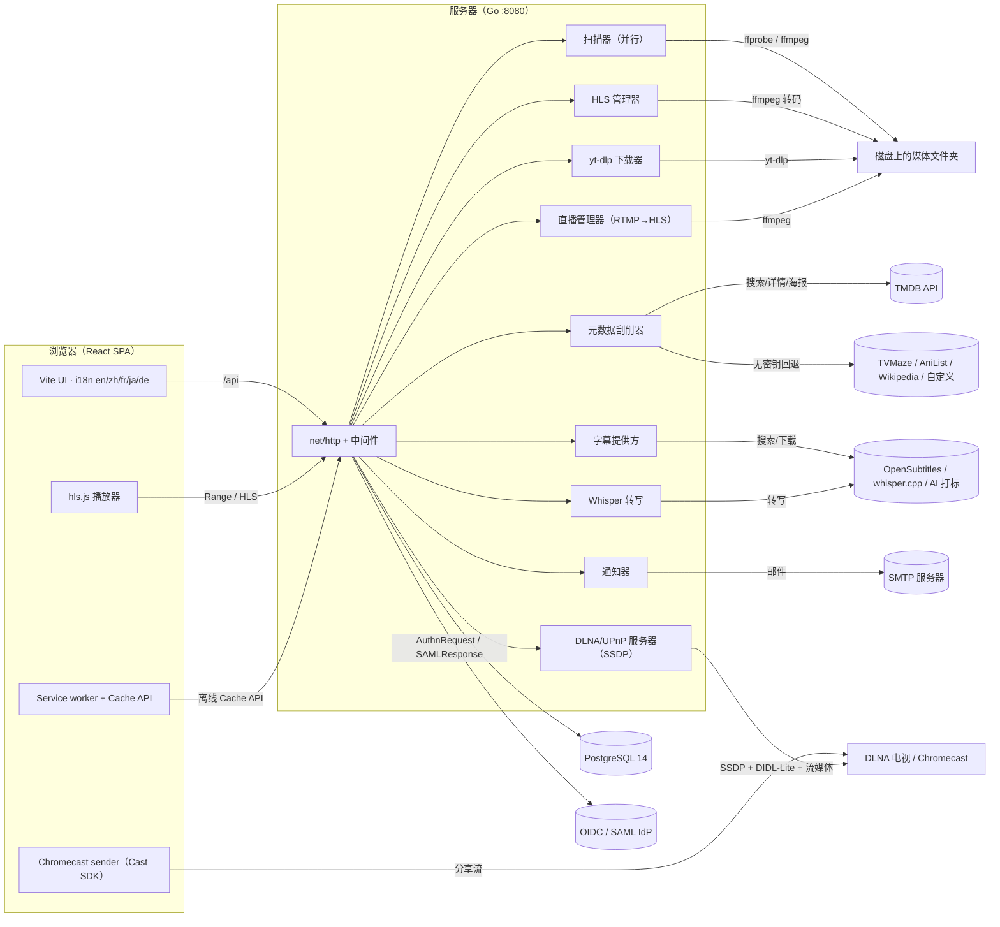
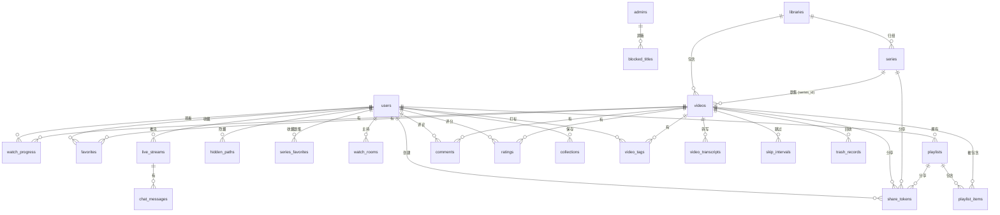
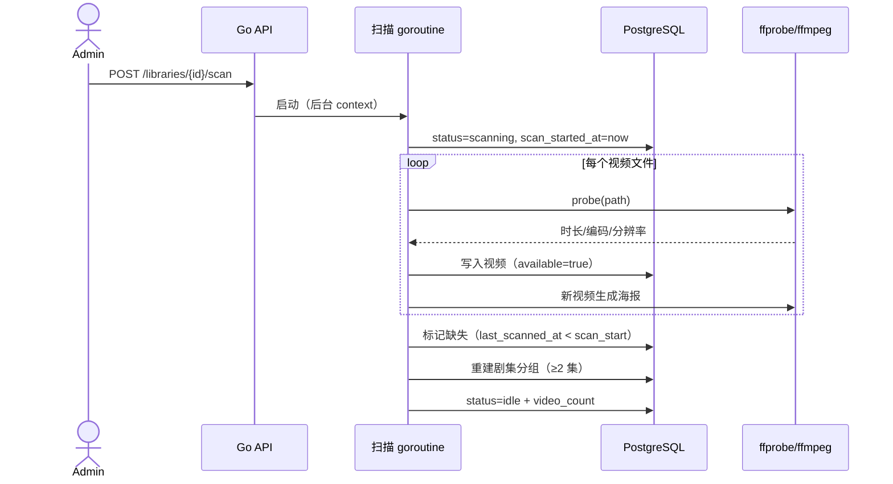
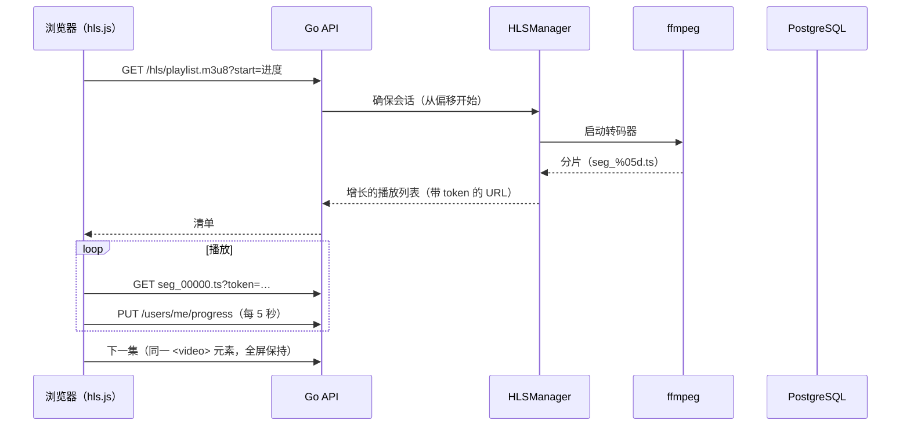

# VideoCMS — 系统架构设计

> **语言:** [English](architecture.md) | 中文 | [日本語](architecture.ja.md)

## 1. 概述

VideoCMS 是一个自托管的视频资源管理系统。用户把服务器上的文件夹指给系统，系统将其扫描进
媒体库、提取元数据，并通过 Web 播放器提供浏览与播放。目标是做一个轻量、可扩展、完全由
所有者掌控的 Emby/Jellyfin 替代品。

### 1.1 目标

- 把服务器上任意文件夹扫描成可搜索的视频媒体库
- 提取技术元数据（编码、分辨率、时长），并补充海报、简介、类型
  （文件名解析、ffmpeg 抽帧、可选 TMDB 刮削）
- 浏览器内播放：格式兼容时原生播放，否则实时 HLS 转码
- 每用户状态：观看进度、收藏、播放列表
- 管理能力：媒体库管理、元数据编辑、用户管理
- 多语言界面（en/zh/fr/ja/de），默认英文

### 1.2 当前范围外的目标

- 不接入在线流媒体服务、不做 P2P

## 2. 系统总览



```
┌────────────────────┐        HTTP/JSON + Range 流媒体        ┌─────────────────────────┐
│  React SPA (Vite)   │ ──────────────────────────────────────▶ │  Go 后端 (:8080)        │
│  i18n en/zh/fr/ja/de│                                         │  net/http + pgx         │
└─────────┬──────────┘                                         └────────────┬────────────┘
          │  /api 代理（开发）/ 静态托管（生产）                              │ ffprobe / ffmpeg
          │                                                                    ▼
          └────────────────────────────────────────────────── 媒体库磁盘文件夹（视频文件）
                                                              │
                     PostgreSQL 14 ── 元数据 / 用户 / 进度 / 收藏 / 播放列表
```

三个运行时部分：

| 部分 | 技术 | 职责 |
| --- | --- | --- |
| Web 界面 | React 19、Vite 8、react-router、i18next、hls.js | 浏览/搜索/播放、管理后台、语言切换 |
| 后端 | Go（net/http 标准库、pgx/v5） | 认证、媒体库管理、扫描、流媒体、HLS、刮削 |
| 存储 | PostgreSQL 14 + 服务器磁盘 | 元数据数据库；视频文件与生成的海报/HLS 分片在磁盘上 |

## 3. 后端设计

### 3.1 分层结构

```
backend/
  cmd/server/main.go          入口：配置 → 数据库 → 迁移 → HTTP 服务
  internal/
    config/                   基于环境变量的配置
    db/                       pgx 连接池、内嵌 SQL 迁移、管理员种子
    models/                   共享领域类型
    auth/                     JWT 签发/校验、认证中间件（Bearer 或 ?token=）
    media/
      scanner.go              媒体库扫描（并行遍历 + 探测 + 写入）
      scraper.go              TMDB 元数据增强
      episode.go              从文件名识别剧集/季
      hls.go                  HLS 转码会话管理
      stream.go               HTTP Range 流媒体
      segment.go              HLS 分片文件名校验
      tracks.go               ffprobe 流信息查询（转封装下载用）
      downloader.go           yt-dlp 任务执行器（队列 + 定时）
      live.go                 RTMP 推流 → 滚动 HLS（LiveManager）
      whisper.go              本地语音转写（whisper.cpp）
      subtitle_provider.go    可插拔在线字幕搜索/下载
      thumbnails.go           预览缩略图提取
      health.go               媒体健康检查（缺失/损坏/重复）
      nfo.go                  Kodi 风格 NFO 导入/导出
      analyze.go              外部 AI 打标工具集成
      notify.go               webhook / Apprise / SMTP 通知分发
      dlna.go                 SSDP 响应 + UPnP 设备身份
    api/
      router.go               路由表、CORS/日志/恢复中间件
      json.go                 JSON 工具
      handlers_*.go           按领域分组的 HTTP 处理器
```

### 3.2 HTTP 层

- 路由使用 Go 1.26+ `net/http.ServeMux` 模式
  （`"GET /api/videos/{id}"`、`"GET /api/videos/{id}/hls/{file...}"`）
- 中间件链包裹路由：panic 恢复 → 请求日志 → CORS
  （默认通配；前后端分离部署时可用 `CORS_ORIGINS` 限制来源）
- 请求体限制大小（`http.MaxBytesReader`）
- 所有 API 响应为 JSON；错误格式 `{"error": "..."}`；列表返回
  `{"items": [...], "total", "page", "page_size"}`

### 3.3 认证与授权

- 密码使用 **bcrypt** 哈希；登录签发 **HS256 JWT**（7 天有效）
- 默认 `Authorization: Bearer <token>`；媒体端点（`<video>`/`` 无法设置请求头）
  额外支持 `?token=<jwt>`
- 两个角色：`user` 与 `admin`
  - `RequireAuth` 每次请求从数据库重新加载用户，角色变更立即生效
  - `RequireAdmin` 保护媒体库变更、元数据编辑、刮削、统计、目录浏览与用户管理
- 用户管理守卫：不能删除自己、不能删除/降级最后一个管理员

### 3.4 数据库结构

由内嵌 SQL 迁移管理（`schema_migrations` 表记录版本）。

```sql
users           -- id, username(唯一), password_hash, display_name, role,
                --   oauth_sub(唯一, 本地账号为 NULL；SSO 为 "oidc:…"/"saml:…"),
                --   pin(bcrypt, 家长解锁), allowed_rating, created_at
libraries       -- id, name, path(唯一), scan_status(idle|scanning|error|cancelled),
                --   scan_error, scan_started_at, scan_finished_at, video_count,
                --   blocked, quota_bytes
videos          -- id, library_id(外键), title, filename, file_path(唯一), size_bytes,
                --   duration_sec, width, height, video_codec, container, year, synopsis,
                --   genres(text[]), poster_path, subtitle_path, tmdb_id, scraped_at,
                --   available, content_rating, created_at, updated_at, last_scanned_at
watch_progress  -- 主键(user_id, video_id), position_sec, duration_sec, updated_at
favorites       -- 主键(user_id, video_id), created_at
playlists       -- id, user_id(外键), name, description, 时间戳
playlist_items  -- 主键(playlist_id, video_id), position, added_at
series          -- id, library_id(外键), name, season, episode_count, 时间戳
videos          -- + series_id(外键→series, ON DELETE SET NULL), season, episode
blocked_titles  -- id, title, created_at（管理员按标题屏蔽内容）
hidden_paths    -- id, user_id(外键), path, created_at（按用户隐藏路径）
series_favorites-- 主键(user_id, series_id), created_at
share_tokens    -- id, scope(video|series|playlist), video_id/series_id/playlist_id
                --   (外键, ON DELETE CASCADE), token(唯一), expires_at,
                --   password_hash（可选 bcrypt）, allowed_domains（text[]）,
                --   created_by(外键→users), created_at（公开分享链接）
subtitle_tracks -- id, video_id(外键, ON DELETE CASCADE), position, lang, title,
                --   path, kind(sidecar|embedded|upload), source_key(视频内唯一),
                --   stream_index（多语言字幕轨道）
user_subtitle_prefs -- 主键(user_id, video_id), track_id(外键, ON DELETE CASCADE),
                --   updated_at（按用户的默认字幕轨）
subtitle_offsets -- 主键(user_id, video_id), offset_ms, updated_at
                --   （按用户的字幕同步；服务 WebVTT 时应用偏移）
uploads         -- id, filename, target_path, total_size, chunk_size,
                --   status(uploading|completed|failed), error, 时间戳
                --   （分片上传会话；分片存放在 DATA_DIR/uploads/<id>/）
downloads       -- id, url, title, target_path, format, status(queued|downloading|
                --   completed|failed|canceled), progress, error, interval_secs,
                --   last_run_at, 时间戳（yt-dlp 任务，支持定时重复）
watch_rooms     -- id, code(唯一), video_id, owner, playing, position_sec,
                --   updated_at（一起看会话，每 2.5 秒轮询）
live_streams    -- id, title, stream_key(唯一), status(offline|starting|live|idle),
                --   error, created_by(外键→users), 时间戳（RTMP 推流）
chat_messages   -- id, stream_id(外键, ON DELETE CASCADE), user_name, text, created_at
video_transcripts -- 主键(video_id, lang), transcript_path, format(webvtt|text),
                --   updated_at（Whisper 输出，可搜索）
tags            -- id, name(唯一), created_at
video_tags      -- 主键(video_id, tag_id), tagged_by(外键→users, NULL = 自动),
                --   created_at
collections     -- id, user_id(外键), name, filters(jsonb), created_at
                --   （由保存的搜索条件生成的智能合集）
trash_records   -- id, video_id(外键), original_path, trashed_at, restored_at
                --   （批量“移到回收站”与恢复）
comments        -- id, video_id(外键, ON DELETE CASCADE), user_id(外键),
                --   text, created_at
ratings         -- 主键(video_id, user_id), score(1-5), updated_at
storage_pools   -- id, name(唯一), type(local|s3|sftp), mount_path,
                --   config(jsonb), read_only, created_at（上传/下载目标）
webhook_subscriptions -- id, url, events(text[]), secret, active, 时间戳
skip_intervals  -- 主键(video_id, kind), kind(intro|credits), start_sec, end_sec,
                --   updated_at（片头/片尾跳过条）
```

关键索引：`videos(lower(title))`、`videos(library_id)`、部分索引
`videos(available) WHERE available`、`watch_progress(user_id, updated_at DESC)`、
`playlist_items(playlist_id, position)`。



### 3.5 流媒体（HTTP Range）

`GET /api/videos/{id}/stream` 直接打开磁盘文件，以 `Accept-Ranges: bytes` 提供，
支持单 Range 请求（`206 Partial Content`）。Content-Type 按扩展名推断
（`video/mp4`、`video/x-matroska` 等）。浏览器兼容的文件零 CPU 开销。

### 3.6 HLS 转码

浏览器无法播放的格式（如 MKV/HEVC），播放器回退到
`GET /api/videos/{id}/hls/playlist.m3u8?start=<秒>`。

`HLSManager`：

- 每个视频会话启动一个 ffmpeg 进程，同时产出多档自适应码率
  （1280/854/640/426px，按源分辨率截断）：
  `-ss <start> -i <input> -c:v libx264 -preset veryfast -crf 23
  -vf scale=<width>:-2 -force_key_frames expr:gte(t,n_forced*6) -c:a aac -b:a 96k
  -f hls -hls_time 6 -hls_list_size 0 -hls_flags independent_segments`
- 视频编码默认使用软件 x264；`HLS_HW_ACCEL=videotoolbox|nvenc|qsv|vaapi` 可切换到
  硬件编码器（`h264_videotoolbox` / `h264_nvenc` / `h264_qsv` / `h264_vaapi`），
  VAAPI 设备由 `HLS_VAAPI_DEVICE` 指定并使用 `hwupload`/`scale_vaapi` 管线；
  `HLS_TONE_MAP=1` 会在 filter 链前置软件 `zscale`+`tonemap` 做 HDR→SDR；
  软件转码可用 `HLS_VCODEC=libx265|libsvtav1|libvpx-vp9` 输出 HEVC/AV1/VP9，
  `HLS_PASSTHROUGH_HDR=1`（默认）在 10-bit 编码器上保留 Dolby Vision / HDR10+
  信号，8-bit 编码器回退为色调映射；非法取值直接使会话启动失败，而不是静默降级
- 每档写入 `data/hls/<video-id>/v<宽度>/`；服务端生成引用所有档位、并为每条字幕轨
  输出一个 `#EXT-X-MEDIA` 条目（`subs/<轨道id>/playlist.m3u8`，内嵌轨首次请求时
  按需提取）的 master 播放列表。清单随转码增长，ffmpeg 结束后由服务端追加
  `#EXT-X-ENDLIST`
- 多音轨源：每条音轨单独 remux 为一条 AAC HLS 音轨（`a<索引>/`），并通过
  `#EXT-X-MEDIA` AUDIO 分组对外发布，各视频档位引用该分组
  （`AUDIO="audio"`），播放器无需重启转码会话即可切换音轨
- 字幕同步：`GET /api/videos/{id}/subtitles/{trackId}?offset_ms=…` 会平移
  所有 cue 时间（WebVTT/SRT），并由按用户的 `subtitle_offsets` 持久化，
  直接播放时自动记住调整值
- 预览缩略图：`GET /api/videos/{id}/thumbnails` 按需抽取每 10 秒一帧
  160×90 的缩略图（最多 120 帧）到 `DATA_DIR/thumbnails/<video-id>/`；
  `GET /api/videos/{id}/thumbnails/{n}` 提供单帧，播放器在进度条悬停时
  显示最近时间点的预览帧
- ASS 样式字幕：`.ass/.ssa` 轨带有 `format` 字段，不进入 hls.js 字幕组，
  由播放器用 libass WASM 覆盖层（jassub）渲染，保留字体、颜色、位置与特效，
  并跟随用户的字幕偏移
- 在线字幕：`SubtitleProvider` 抽象（默认 OpenSubtitles.com，通过
  `SUBTITLE_OS_*` 配置）支撑 `POST /api/videos/{id}/subtitles/search|download`；
  下载内容从 gzip/zip 解码后存到 `DATA_DIR/subtitles/<video-id>/`，
  并注册为 `upload` 字幕轨
- 一起看：`watch_rooms`（迁移 018）保存共享口令与当前播放/暂停状态与位置；
  成员每 2.5s 轮询 `GET /api/watch/rooms/{id}?token=…` 并通过 PUT 发布状态，
  实现松同步播放。投屏：浏览器支持时播放器提供 Web AirPlay 按钮
  （`webkitShowPlaybackUI`），另有「投屏到电视」按钮加载 Google Cast SDK，
  把短期分享链接推送到默认媒体接收器
- 直播：`live_streams` 与 `chat_messages`（迁移 019）。`LiveManager` 把 RTMP
  推流（`RTMP_INGEST_URL` + 每条流自己的 key）拉取为滚动 HLS 清单
  （`data/live/<id>/index.m3u8`）；观看走 `GET /api/live/{id}/hls/...`，
  聊天通过轮询 `GET|POST /api/live/{id}/chat`
- 语音转写：`POST /api/videos/{id}/transcribe`（管理员）用 whisper.cpp CLI
  （`WHISPER_BIN`/`WHISPER_MODEL`）生成 WebVTT 文稿，存入 `video_transcripts`
  （迁移 020）并注册为字幕轨；视频搜索也会匹配文稿文本
- 标签与 AI：`tags`/`video_tags`（迁移 021）支撑手动
  `GET|POST|DELETE /api/videos/{id}/tags` 与 `POST /api/videos/{id}/analyze`
  （运行外部打标工具 `AI_TAG_BIN`，每行一个标签，存为 auto 标签）；
  `GET /api/videos?tag=` 可按标签过滤
- 推荐：`GET /api/videos/{id}/similar` 按共享类型、年份、系列与标签给其他
  视频排序；`GET /api/tags` 驱动浏览页标签云与 `?tag=` 过滤
- 合集与保存筛选（迁移 022）：`collections` 按用户保存命名的筛选 JSON
  （`GET|POST|DELETE /api/collections`），`user_filter_prefs` 保存最近一次
  浏览筛选（`GET|PUT /api/users/me/filters`）；前端对两者复用同一套
  `/videos` 筛选参数回放
- 搜索：标题/简介/文件名/类型/文稿的子串匹配由 pg_trgm GIN 索引加速
  （迁移 023）；`sort=fuzzy` 将过滤切换为三元组相似度 > 0.15 并按该分数排序
- 请求的 `start` 与当前会话相差超过一个分片（6 秒）时，杀掉旧会话并从新位置重启（跳转）
- 清单在响应时重写，使每个分片 URL 都携带 `?token=`
- 空闲会话 **15 分钟**后回收，同时删除会话目录
- 服务端不阻塞转码：播放从第一个完成的分片开始

### 3.7 媒体扫描器

每个媒体库在后台 goroutine 中执行 `Scanner.scan`：

1. 设置 `scan_status=scanning`，记录 `scan_started_at`
2. `filepath.WalkDir` 发现视频文件；跳过隐藏文件/目录、`.m3u8` HLS 流文件夹
   （以及 macOS `._` 资源分叉文件）
3. 工作池（默认 **4**，`SCAN_WORKERS` 可设 1-16）用 ffprobe 探测每个文件（30 秒超时）
   并写入视频记录
4. 新记录用 ffmpeg 抽取海报帧（60 秒超时，`scale=480:-2`，取 15% 处画面）；
   同目录字幕（`.srt/.vtt/.ass/.ssa`）与全部内嵌文字字幕轨登记为
   `subtitle_tracks`，第一条成为生效的 `subtitle_path`
5. 每收录 20 个更新 `video_count`，UI 显示实时进度
6. 完成后，本次未扫描到的文件标记 `available=false`
   （依据 `last_scanned_at < scan_start`），取消扫描不会误标
7. 取消（`POST /api/libraries/{id}/scan/cancel`）通过取消 context 实现；
   状态变为 `cancelled`，已收录记录保留
8. panic 会被恢复并显示为 `scan_status=error`；服务重启会把残留的 `scanning`
   状态重置为 `error`

**增量入库**：`Scanner.Watch` 将 fsnotify 事件监听（递归，每个库根目录一个
watcher）与差异扫描结合。变更文件（包括大小不变的修改）数秒内即被重新探测，
被删除的文件/目录立即标记为不可用；同时仍以 `WATCH_INTERVAL` 周期跑全量差异
扫描作为兜底。

通过其他途径进入媒体库目录的文件（分片上传完成、yt-dlp 下载完成、外部拷贝等）
也会被同一个 watcher 捕获并自动入库。

**剧集自动分组**：每次扫描后 `rebuildSeries` 从标题解析集数标记
（`S01E01`、`EP1`、`E01`、`第1集`、结尾括号数字等），把共享前缀 + 同季的视频归组，
组内 ≥2 集时创建 `series` 记录。视频保存 `series_id/season/episode`；
通过 `GET /api/series` 列出，并作为独立的「电视剧 / 剧集」分类浏览。
不足 2 集可用的剧集会自动清理。

探测失败的文件仍会以空技术元数据入库，让所有者能看到并决定如何处理。

### 3.8 元数据刮削（TMDB / TVMaze / AniList / Wikipedia）

可选。配置了 `TMDB_API_KEY` 时走 TMDB；未配置时依次回退到免密钥的 TVMaze、
AniList 与 Wikipedia（`TVMAZE_ENABLED=0` / `ANILIST_ENABLED=0` /
`WIKIPEDIA_ENABLED=0` 可分别关闭）。`Scraper`：

- 先搜索提供商（TMDB 语言可配置，默认 `zh-CN`），TMDB 再取影片详情获取本地化类型名
- 可通过 `SCRAPE_CUSTOM_URL` 提供自定义源（JSON 端点，`%s` 为标题占位符）：
  `POST /api/videos/{id}/scrape?provider=custom` 使用它，`?force=1` 覆盖已有
  元数据；未带 force 时已有元数据的视频返回 409（单条覆盖）
- 下载 `w500` 海报到 `data/posters/<video-id>.<ext>`
- 更新 `title, year, synopsis, genres, poster_path, tmdb_id, scraped_at`
- 限速：每 400ms 一次请求
- 扫描时只补充「无简介且从未刮削」的视频；手动
  `POST /api/videos/{id}/scrape` 总是覆盖

### 3.9 管理端点

- `GET /api/admin/stats` — 聚合统计与总字节数
- `GET /api/admin/paths?path=…` — 服务器目录浏览器（子目录、上级、主目录快捷方式、
  通过 `statfs` 获取磁盘可用空间），供目录选择器使用；输入会被归一化为干净的
  绝对路径，相对路径和 `..` 段都会解析在 `/` 之下
- 创建媒体库（`POST /api/libraries`）要求服务器绝对路径；相对路径会被拒绝，
  路径经 `filepath.Clean` 归一化
- 上传：`GET|POST /api/uploads`、`GET /api/uploads/{id}`、
  `PUT /api/uploads/{id}/chunk/{index}`、`POST /api/uploads/{id}/complete`、
  `DELETE /api/uploads/{id}` — 向任意服务器绝对路径分片可续传上传；
  完成后由媒体库文件监听自动收录
- 下载：`GET|POST /api/downloads`、`DELETE /api/downloads/{id}`、
  `POST /api/downloads/{id}/retry` — yt-dlp 下载队列，支持按间隔重复；
  后台 worker（`media.Downloader`）逐个执行并记录进度
- 转封装下载：`GET /api/videos/{id}/tracks` 列出音轨/字幕流，
  `GET /api/videos/{id}/download/remux?container=…&audio=…&sub=…&sidecar=…`
  以所选轨道流式输出无需重编码的副本
- 用户管理：列表 / 改角色 / 重置密码 / 删除（带守卫）
- 内容屏蔽：`GET|POST /api/admin/blocked-titles`、
  `DELETE /api/admin/blocked-titles/{id}` — 标题按不区分大小写的子串匹配；
  被屏蔽的媒资保留在磁盘上，解除后立即恢复
- 媒体库屏蔽：`PATCH /api/libraries/{id}`（`{"blocked": true|false}`）
  隐藏整个媒体库；该标记在同一 SQL 可见性条件中求值
- 打开媒体库目录：`POST /api/libraries/{id}/open` 在服务器上调用系统文件管理器
  （`open` / `xdg-open` / `explorer`）打开媒体库路径
- 健康检查：`POST /api/libraries/{id}/health` 报告缺失/损坏文件与重复候选
  （声明大小相同）；`POST /api/libraries/{id}/health/keep-best` 保留每组最佳
  （分辨率最高，其次文件名最长），其余移入 `DATA_DIR/trash/<日期>/`
- 批量与回收站：`POST /api/admin/videos/batch` 批量打标、清空标签或把选中
  视频移入回收站；`trash_records`（迁移 024）保存原始路径，
  `GET /api/admin/trash` + `POST /api/admin/trash/{id}/restore` 可移回文件并
  重新启用
- NFO：`POST /api/libraries/{id}/export-nfo` 在每个视频旁写 Kodi 风格电影 NFO，
  `/import-nfo` 把 title/year/plot/genres 解析回数据库
  （media.NFOFileFor/WriteNFO/ReadNFO）
- 社交（迁移 025）：`comments` 与 `ratings` 表支撑按视频评论
  （`GET|POST /api/videos/{id}/comments`、`DELETE /api/comments/{id}`）、
  1-5 星评分（`GET /api/videos/{id}/ratings`、`PUT /api/videos/{id}/rating`），
  `GET /api/feed` 返回最近的评论与收藏
- OIDC SSO：`GET /api/auth/oidc/start|callback` 实现发现 + 授权码 + userinfo
  （`OIDC_*` 配置）；用户通过唯一 `users.oauth_sub` 列（迁移 026）自动创建或
  绑定，前端经 `/login?sso_token=…` 获取会话 JWT
- SAML 2.0 SSO：基于 crewjam/saml——`GET /api/auth/saml/login` 以
  AuthnRequest（HTTP-Redirect/POST 绑定）重定向到 IdP，
  `POST /api/auth/saml/acs` 消费并校验签名的 SAMLResponse（签名、条件、
  audience），`/api/auth/saml/metadata` 向 IdP 发布 SP 元数据。配置：
  `SAML_IDP_METADATA_URL`、`SAML_SP_CERT`、`SAML_SP_KEY`、
  `SAML_SP_ENTITY_ID`、`SAML_ACS_URL`。用户绑定到同一 `users.oauth_sub`
  （前缀 `saml:`），首次登录时 `roles` 属性包含 "admin" 即授予管理员；
  `GET /api/auth/sso` 告知登录页提供哪些提供方
- 家长控制与配额（迁移 027）：bcrypt 的 `users.pin` 配合
  `PUT|POST /api/users/me/pin[/verify]` 签发 5 分钟解锁令牌，列表请求通过
  `X-Videocms-Unlock` 接受；`users.allowed_rating` 过滤 `videos.content_rating`
  （未解锁时），`libraries.quota_bytes` 在上传目标指向该库时生效
- 分享定制（迁移 028）：创建分享可携带 `theme`/`custom_title`/`hide_nav`，
  存在 `share_tokens` 并由公开 info 端点返回；分享页应用这些设置，
  `?embed=1` 隐藏页面装饰以便 iframe 嵌入
- 通知：`media.Notifier` 向 `NOTIFY_WEBHOOK_URL` 与/或 Apprise API
  （`NOTIFY_APPRISE_URL`）推送 JSON，覆盖扫描完成/失败、yt-dlp 下载完成/失败、
  上传完成事件；`POST /api/admin/notify/test` 可发送测试事件。SMTP 通道
  （`SMTP_HOST`/`SMTP_PORT`/`SMTP_USER`/`SMTP_PASSWORD`、
  `NOTIFY_EMAIL_FROM`/`NOTIFY_EMAIL_TO`）经隐式 TLS（465）或 STARTTLS
  发送纯文本邮件，复用同一批事件
- 存储池（迁移 029）：`storage_pools` 保存命名本地/S3/SFTP 池（本地挂载路径 +
  JSON 配置）；管理端 `GET|POST|PATCH|DELETE /api/admin/storage-pools`，
  上传/下载目标支持 `pool://名称[/子路径]`，解析到挂载路径
  （远端池通过 s3fs/sshfs 式挂载路由）
- 任务看板：`GET /api/admin/jobs` 把扫描、上传、下载与直播聚合为统一列表，
  `GET /api/admin/system` 报告磁盘剩余/总量；管理 UI 提供按任务的上下文操作
- 维护：`StartMaintenance` 每隔 `MAINT_INTERVAL_HOURS` 执行——完整 JSON 备份到
  `DATA_DIR/backups`（保留 `MAINT_BACKUP_RETENTION` 份）、每库健康检查，
  可选重扫（`MAINT_RESCAN=1`）；手动触发
  `POST /api/admin/maintenance/run`，备份列表/下载见 `GET /api/admin/backups[/{name}]`
- Webhook 与 API 文档（迁移 030）：`webhook_subscriptions`（管理端
  `/api/admin/webhooks` CRUD）接收按事件过滤、带
  `X-Videocms-Signature`（HMAC-SHA256）签名的 JSON 事件；
  公开接口由 `GET /api/openapi.json` 描述
- PWA：前端提供 web manifest 与 service worker（只缓存应用壳，绝不缓存
  API/媒体）；详情页可把流保存进 Cache API 供离线观看；
  `viewport-fit=cover` + 安全区 padding 适配刘海屏
- 片头/片尾跳过（迁移 031）：`skip_intervals(video_id, kind,
  start_sec, end_sec)` 为每个视频保存最多一个 `intro`/`credits` 区间；
  播放器通过 `GET /api/videos/{id}/skip-intervals`、
  `PUT /api/videos/{id}/skip-interval` 与
  `DELETE /api/videos/{id}/skip-interval?kind=…` 标记、更新与清除区间，
  点击跳过时跳转到 `end_sec`
- 投屏：`DLNA_ENABLED=1` 时后端运行轻量 UPnP 媒体服务器——SSDP 响应
  :1900 的 M-SEARCH，`/dlna/device.xml` 描述设备，
  `/dlna/content/{id}` 与 `/dlna/control/ContentDirectory`（SOAP）
  提供 DIDL-Lite 浏览结果，`/dlna/video/{id}/stream|poster`
  对局域网客户端免 JWT 提供媒体（`DLNA_ALLOWED_IPS` 按 IP/CIDR
  限制，留空表示整个局域网）。Chromecast 由前端 sender 实现：播放器
  加载 Cast SDK、创建短期分享 token，并将
  `/api/share/{token}/video/{id}/stream` 投放到默认媒体接收器

### 3.10 关键设计决策

- **只用标准库** — 后端直接使用 Go 的 `net/http` 路由模式与 `pgx`，无框架锁定，易于审计
- **后台扫描 + 工作池** — 探测在外部磁盘上是 I/O 密集；4 个 worker（可配置）平衡吞吐与 CPU。
  进度写入数据库，UI 通过轮询简单的媒体库状态而非长连接
- **同元素播放切换** — 播放器在常驻的 `<video>` 元素上换源而非重建，浏览器全屏在剧集连播间保持
- **HLS 实时增长清单** — ffmpeg 原地写清单（不做 VOD 缓冲），完成时补写 `#EXT-X-ENDLIST`；
  分片完成后才进入清单，数小时的长片也能约 1 秒起播
- **按用户隐私过滤** — 隐藏路径在 SQL 中求值（`starts_with`），对所有列表一致生效
- **管理员内容屏蔽** — `blocked_titles` 并入统一的可见性条件
  （`visibleEpisodes`），被屏蔽的媒资会从所有列表（含剧集、收藏、播放列表）同时消失，
  文件不受影响；管理员可通过 `GET /api/videos?include_blocked=1` 查看被屏蔽的内容
- **媒体库级屏蔽** — `libraries.blocked` 在 `visiblePaths` 中以
  `NOT EXISTS (SELECT 1 FROM libraries lb WHERE lb.id = v.library_id AND lb.blocked)`
  求值，被屏蔽的媒体库会从所有面向用户的列表（含剧集、继续观看）一次消失
- **媒体 URL 携带用户 JWT**（`?token=`），因为 `<video>`/`` 标签无法设置请求头

## 4. 前端设计

### 4.1 结构

```
frontend/src/
  api.js           fetch 封装（token、JSON、401 跳转）
  auth.jsx         认证上下文（用户、登录/注册/退出）
  i18n/            i18next 配置 + en/zh/fr/ja/de 语言 JSON
  components/      Navbar、Poster、VideoCard、PathPicker、ShareModal、
                   SubtitleSearchModal、DownloadDialog、UploadManager、Toast
  pages/           Login、Browse、VideoDetail、Player、Playlists、
                   PlaylistDetail、SeriesList、SeriesDetail、Share、Live、
                   Favorites、Admin（+ Uploads/Downloads/Storage/Jobs/Webhooks
                   管理标签页、Blocked 标题）
```

### 4.2 路由与状态

- `react-router-dom` v6；未登录用户重定向到 `/login`
- 认证状态在 React context，JWT 存 `localStorage`
- i18n：`i18next` + `react-i18next`，默认 **英文**，选择存 `localStorage`，
  支持 en/zh/fr/ja/de

### 4.3 播放

- H.264 MP4 / WebM / MOV → 原生 `<video>` + Range 流媒体
- 其他格式 → 动态 `import('hls.js')`，带 `start` 偏移的 HLS 播放列表；
  缓冲范围外跳转会重启转码会话
- 每播放 5 秒及暂停/结束时保存进度（绝对位置 = 会话偏移 + 媒体时间）
- 原生播放失败时提供「转码播放」兜底

### 4.4 管理界面

标签页：**概览**（统计、备份导出/导入、运行维护、测试通知）、**媒体库**
（服务端目录选择器、扫描/停止、健康检查/保留最佳、NFO 导入/导出、屏蔽）、
**视频**（搜索、编辑元数据、刮削、海报、批量操作、回收站）、**用户**
（角色、重置密码、删除）、**上传**（分片上传）、**下载**（yt-dlp 队列）、
**存储**（本地/S3/SFTP 池）、**任务**（扫描/上传/下载/直播 + 磁盘用量）、
**Webhooks**（订阅 + OpenAPI）。

## 5. 关键流程

### 5.1 媒体库扫描



```
管理界面 ──POST /api/libraries/{id}/scan──▶ scanner.Start（goroutine）
   │                                          │
   │  轮询 GET /api/libraries（3 秒）          ├─ WalkDir（跳过隐藏/.m3u8）
   │                                          ├─ 工作池：ffprobe → 入库 → 海报
   │                                          ├─ 每 20 个更新 video_count
   │                                          └─ 标记缺失 → idle/error/cancelled
   ◀── 扫描状态 + 实时数量 ──────────────────┘
```

### 5.2 播放（不兼容格式）



```
播放器 ──GET /hls/playlist.m3u8?start=进度──▶ HLSManager
   │                                            ├─ 启动/杀掉 ffmpeg 会话
   │  分片（带 ?token=）◀──────────────────────┴─ 写入 data/hls/<id>/
   └─ hls.js → <video> ──每 5 秒 PUT /users/me/progress
```

## 6. 配置

### 6.1 部署形态

| 模式 | 方式 | 说明 |
| --- | --- | --- |
| 开发 | `go run ./cmd/server` + `npm run dev` | Vite 代理 `/api` 到 :8080；热更新 |
| 单端口生产 | `make serve` | 后端托管构建好的 `frontend/dist`；UI 与 API 同一端口 |
| Docker 数据库 | `docker compose up -d db` | PostgreSQL 14 容器；后端仍原生运行 |
| 反向代理 | Nginx/Caddy → :8080 并启用 TLS | 公网访问推荐；需设置 `JWT_SECRET` |

后端绑定所有网卡（`:8080`），局域网客户端可直接访问 UI。

| 变量 | 默认值 | 用途 |
| --- | --- | --- |
| `PORT` | `8080` | 监听地址 |
| `DATABASE_URL` | `postgres://localhost:5432/videocms` | PostgreSQL 连接串 |
| `JWT_SECRET` | 开发用常量 | 令牌签名密钥（生产必须设置） |
| `DATA_DIR` | `data` | 海报 + HLS 分片 |
| `ADMIN_USERNAME` / `ADMIN_PASSWORD` | admin / admin123 | 初始管理员 |
| `FFPROBE_BIN` / `FFMPEG_BIN` | 自动探测 | 工具路径（含 Homebrew 回退） |
| `TMDB_API_KEY` / `TMDB_LANGUAGE` | 空 / zh-CN | 刮削 |
| `SCAN_WORKERS` | `4` | 并行探测工作数 |
| `CORS_ORIGINS` | 空（`*`） | 允许调用 API 的浏览器来源 |
| `WATCH_INTERVAL` | `30` | 增量扫描兜底间隔（秒）；fsnotify 事件即时索引 |
| `YTDLP_PATH` | PATH 上的 yt-dlp | 下载队列使用的 yt-dlp 二进制 |
| `WEB_ROOT` | 自动（`frontend/dist`） | 生产模式下内置的前端目录 |
| `HLS_HW_ACCEL` / `HLS_VAAPI_DEVICE` / `HLS_TONE_MAP` / `HLS_VCODEC` / `HLS_PASSTHROUGH_HDR` | 空 / `/dev/dri/renderD128` / `0` / 空（libx264）/ `1` | 硬件 HLS 编码（videotoolbox/nvenc/qsv/vaapi）、VAAPI 设备、HDR→SDR 色调映射、软件编码器（libx264/libx265/libsvtav1/libvpx-vp9）、HDR 直通 |
| `SUBTITLE_OS_USERNAME` / `SUBTITLE_OS_PASSWORD` / `SUBTITLE_OS_API_KEY` | 空 | OpenSubtitles 在线字幕搜索凭据 |
| `RTMP_INGEST_URL` | `rtmp://localhost:1935/live` | 直播 RTMP 推流基础地址 |
| `WHISPER_BIN` / `WHISPER_MODEL` | 空 | whisper.cpp CLI + 模型（转写） |
| `SCRAPE_CUSTOM_URL` | 空 | 自定义 JSON 刮削端点（`%s` = URL 编码标题） |
| `AI_TAG_BIN` | 空 | 外部 AI 打标工具（参数为媒体路径，每行一个标签） |
| `OIDC_ISSUER` / `OIDC_CLIENT_ID` / `OIDC_CLIENT_SECRET` / `OIDC_REDIRECT_URL` | 空 | OIDC 单点登录 |
| `SAML_IDP_METADATA_URL` / `SAML_SP_CERT` / `SAML_SP_KEY` / `SAML_SP_ENTITY_ID` / `SAML_ACS_URL` | 空 | SAML 2.0 单点登录 |
| `NOTIFY_WEBHOOK_URL` / `NOTIFY_APPRISE_URL` | 空 | Webhook/Apprise 通知渠道 |
| `SMTP_HOST` / `SMTP_PORT` / `SMTP_USER` / `SMTP_PASSWORD` / `NOTIFY_EMAIL_FROM` / `NOTIFY_EMAIL_TO` | 空 / `587` | SMTP 邮件通知 |
| `MAINT_INTERVAL_HOURS` / `MAINT_BACKUP_RETENTION` / `MAINT_RESCAN` | `24` / `7` / `0` | 定时维护（备份、健康检查、重扫） |
| `DLNA_ENABLED` / `DLNA_FRIENDLY_NAME` / `DLNA_ALLOWED_IPS` | `0` / `VideoCMS` / 空（整个局域网） | UPnP/DLNA 媒体服务器、显示名、IP/CIDR 白名单 |
| `VITE_API_BASE_URL` | 空 | 跨域部署时前端构建期的 API 基地址 |

## 7. 安全考虑

- 所有变更/浏览端点仅限管理员
- 媒体 URL 需要用户 JWT（请求头或查询参数）
- 公开分享链接是不可猜测的令牌，带过期时间、可选密码与域名白名单；
  投屏复用 1 小时视频分享，JWT 不出浏览器
- DLNA 端点设计上不鉴权，但由 `DLNA_ALLOWED_IPS`（IP/CIDR）把关；
  仅在可信局域网留空
- SAML 断言使用 IdP 证书校验（签名、条件、audience）；
  SP 密钥来自 `SAML_SP_CERT`/`SAML_SP_KEY` 文件
- SMTP 通知优先 TLS：465 隐式 TLS，其余 STARTTLS；凭据仅在加密后才发送
- Webhook 投递带 HMAC-SHA256 `X-Videocms-Signature`，接收方可验签
- HLS 分片名严格校验（`seg_\d+\.ts`）并限制在会话目录内
- SQL 全程通过 pgx 参数化
- 默认 `JWT_SECRET` 仅用于开发；明文 HTTP 只建议在可信局域网使用，
  公网访问需前置 HTTPS 反向代理

## 8. 性能说明

- 直接播放的文件流媒体为磁盘 I/O 瓶颈（零转码）
- 并行扫描（4 工作池）在外部 USB 硬盘上约 80 秒索引 1,600 个文件
- 跳过 `._` 资源分叉和 `.m3u8` 分片目录，避免数千次无效探测
- 数据库查询有索引，列表查询分页（默认每页 24 条）
- HLS 转码每个会话最多同时产出 4 档、CPU 密集；空闲会话自动回收

## 9. 扩展点

- **JAV DB 元数据源**（需要 API key；免密钥的 TMDB/TVMaze/AniList/Wikipedia
  已覆盖常见需求）
- **自定义元数据刮削器** — `SCRAPE_CUSTOM_URL` 指向任意 JSON 端点，
  `%s` 替换为 URL 编码标题，无需改代码即可接入自建刮削服务
- **字幕提供方** — `SubtitleProvider` 接口（目前 OpenSubtitles.com）
  可按视频搜索/下载并扩展新来源
- **AI 打标** — 外部二进制（`AI_TAG_BIN`）接收媒体路径并逐行输出标签，
  标签进入 `tags`/`video_tags` 与标签云
- **语音转写** — whisper.cpp（`WHISPER_BIN`）把音频转为可搜索文稿，
  同一管线还能产出 WebVTT 字幕轨
- **通知渠道** — `media.Notifier` 把同一事件分发到 webhook、Apprise 与
  SMTP；新增渠道就是在 `Send` 中加一个分支
- **SSO 提供方** — OIDC 与 SAML 2.0 都归结到 `users.oauth_sub` 绑定；
  新提供方需要一对 start/callback 端点与 upsert 路径
- **DLNA / Chromecast** — UPnP 服务器（`/dlna/*`）与 Cast sender 自成一体；
  DLNA 浏览可扩展新对象容器，分享令牌流程可支撑其他投屏目标
